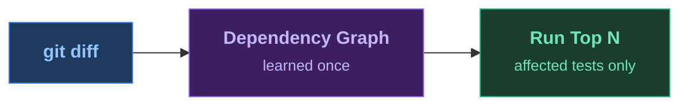

<SlideTitle />

<!--
PRESENTER CHECKLIST:
- Terminal font: 20pt+ (test on projector!)
- Have cloud-sdk-java ready with pre-built index (./prepare.sh)
- Have cap-sflight open in a separate VS Code window (./toggle-test-order-cap.sh on)
- No Wi-Fi needed (all local)
- Timing: Title 20s → Pain 90s → HowItWorks 20s → Magic 30s → Results 15s → AgenticDemo 75s → AgenticLoop 20s → Kicker 15s → Close 15s = ~5min

[click] subtitle appears
[click] show the four ecosystems we support — Java, JUnit 5, Maven, Gradle

→ Immediately to terminal for the pain demo.
-->

---
transition: fade
layout: full
---

<SlideHowItWorks>

</SlideHowItWorks>

<!--
[AFTER the pain demo — audience just watched 90s of tests run]

"That's what CI does on every push. Every PR. Every iteration."
"What if Maven knew which tests actually exercise the code you touched?"
"Learn the dependency graph once. Then select on every commit."

→ Run the magic demo now.
  cd cloud-sdk-java
  mvn test-order:select test -pl cloudplatform/connectivity-destination-service
-->

---
transition: zoom
layout: full
---

<SlideResults />

<!--
[BUILD SUCCESS just appeared — ~17 seconds]

"Seven test classes. 17 seconds. Same confidence."
"No clean rebuild. No guessing. It knows."

→ Next: show this working with an AI agent making a mistake.
  Switch to VS Code with cap-sflight open.
-->

---
transition: fade
clicks: 7
layout: full
---

<SlideAgenticLoop />

<!--
[Back from VS Code — audience just watched Copilot edit, fail, fix, go green]

Click through to recap what they just saw:
[click 1] "The AI made a change."
[click 2] "Copilot ran test-order:select — copilot-instructions.md told it to."
[click 3] "17 seconds: a test failed. Off-by-one on the boundary."
[click 4] "Copilot read the failure and fixed it."
[click 5] "17 seconds again. Green."
[click 6] "Edit → caught → fixed → green. Under 40 seconds."
[click 7] "One instructions file. That's the entire integration."

LIVE PROMPT for Copilot chat:
  "Add max discount validation to DeductDiscountHandler.
   Discounts above 50% should be rejected with an error message.
   After the change, run the tests using the project's test instructions."

FALLBACK if Copilot gets it right first try:
  sed -i '' 's/discount > 50/discount >= 50/' \
    srv/src/main/java/com/sap/cap/sflight/processor/DeductDiscountHandler.java
  mvn test-order:select test -pl srv -Denforcer.skip=true   # red
  sed -i '' 's/discount >= 50/discount > 50/' \
    srv/src/main/java/com/sap/cap/sflight/processor/DeductDiscountHandler.java
  mvn test-order:select test -pl srv -Denforcer.skip=true   # green
-->

---
transition: fade
layout: full
---

<SlideKicker />

<!--
Let this land. Pause. Then advance to the closing slide.
-->

---
transition: fade
layout: full
---

<SlideClose />

<!--
"Star the repo, drop in the plugin, and tell me how much time you saved."
"Thank you."
-->
