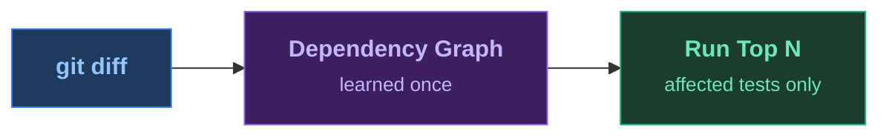

<SlideTitle />

<!--
PRESENTER CHECKLIST:
- Terminal font: 20pt+ (test on projector!)
- cloud-sdk-java built and index ready (./prepare.sh)
- VS Code open on cloud-sdk-java/, .github/copilot-instructions.md visible in a tab
- Dashboard tab open at localhost:8080 (mvn test-order:serve -pl cloudplatform/connectivity-destination-service)
- No Wi-Fi needed (all local)
- Timing: Title 20s → Pain 90s → HowItWorks 20s → Magic 30s → Results 15s → Dashboard 10s → AgenticDemo 75s → AgenticLoop 20s → Kicker 15s → Close 15s = ~5min

[click] subtitle appears
[click] show the four ecosystems: JUnit 5 and 6, JUnit 4 via Vintage, TestNG, Kotest — Maven and Gradle — Java 17+

"The most expensive thing in software delivery is waiting for feedback."

→ Immediately to terminal for the pain demo.
-->

---
transition: fade
layout: full
---

<SlideHowItWorks>

</SlideHowItWorks>

<!--
[AFTER the pain demo — audience just watched 90s of tests run]

"That's what CI does on every push. Every PR. Every iteration."

"What if Maven knew which tests actually exercise the code you touched?"

Here's the idea. You run a learn pass once — the plugin instruments your bytecode with a Java agent and records, for every test class, every production class it touches. No annotations. No JaCoCo. No cloud. Just bytecode instrumentation at class entry, constructor call, and static field access. The whole learn run adds about 12% overhead — similar to checkstyle.

The result is a dependency graph: test → set of production classes. You store that graph locally in .test-order/, compressed with LZ4. It survives across builds. You don't re-learn on every commit — only after major refactors.

On every subsequent run: git diff tells us what changed. We intersect that with the dependency graph. Tests that overlap changed classes score higher. Tests that recently failed score higher. New or changed tests score higher. Fast tests get a small bonus; slow ones a small penalty. The result is a ranked list. You run the top N.

Typical projects see failures surface in the first 5–10% of the suite. This project: 7 out of 17 test classes, in 17 seconds instead of 5 minutes.

→ Now show make-change.sh + toggle + select.
  ./make-change.sh      ← introduces the tenant-routing bug + commits
  ./toggle-test-order.sh on
  cd cloud-sdk-java && mvn test-order:select test
  → RED in ~17s
-->

---
transition: zoom
layout: full
---

<SlideResults />

<!--
[Tests failed — ~17 seconds]

"Seven test classes. 17 seconds. It found a bug."
"No clean rebuild. No guessing. It knows exactly which tests exercise this code."

The scoring isn't random. Each test gets a numeric score composed of:
- dependency overlap with changed classes (sqrt-normalized so large test suites don't dominate)
- change complexity — bigger, denser changes score higher via compression size as information-density proxy
- failure recency — exponential decay: a test that failed last run gets full bonus; three runs ago, nearly zero
- speed — fast tests get a bonus, slow tests a penalty — logarithmic scale around the median duration

Tie-breaking uses greedy Jaccard diversity: among equally-scored tests, we pick the one that covers the most *new* production classes not already covered. Breadth first.

After enough runs (3+), there's also a genetic algorithm optimizer — `mvn test-order:optimize` — that tunes the weights against your actual APFD history. APFD is Average Percentage of Faults Detected: a standard metric for how early in the run you caught failures. It auto-saves tuned weights into the state file.

→ Brief dashboard moment here (10s max):
  Switch to browser tab at localhost:8080
  "It didn't just run the right tests — it's been tracking every run."
  Point at: ranked test list, Analytics tab showing pass/fail history, APFD trend
  "You can see which tests are your most valuable early-warning signals."
  "Which tests always fail together. Which ones have been flaky for weeks."
  Switch back immediately.

→ Now switch to VS Code. Show .github/copilot-instructions.md tab.
  "One file. It tells the agent: after every change, run test-order select."
-->

---
transition: fade
clicks: 7
layout: full
---

<SlideAgenticLoop />

<!--
[Back from VS Code — audience just watched Copilot read failure, fix, go green]

Click through to recap what they just saw:
[click 1] "The AI made a change — introduced a real logic inversion in tenant routing."
[click 2] "test-order:select ran. One instructions file told it to — no custom tooling."
[click 3] "17 seconds. A test failed. DestinationRetrievalStrategyResolverTest caught it."
[click 4] "Copilot read the failure output — the stack trace, the assertion, the class name — and fixed the negation."
[click 5] "17 seconds again. Green."
[click 6] "Edit → caught → fixed → green. Under 40 seconds total."
[click 7] "One instructions file. That's the entire integration."

As a Gradle DevRel once put it: when your feedback loop takes 2× longer, you don't slow down 2× — you slow down 4×. Every extra minute of wait costs you a context switch. An agent that has to wait 5 minutes per iteration makes 18× fewer iterations per hour than one that gets feedback in 17 seconds.

The plugin supports Maven and Gradle, JUnit 5/6, JUnit 4 via Vintage, TestNG, and Kotest — anything running on the JUnit Platform. Zero configuration for most projects: it auto-detects your source packages, instruments them, and builds the graph.

There's also a select mode — `test-order:select` — that commits to running only the affected tests and skipping the rest entirely. Not just reordering. Skipping. That's what you just saw: 17 tests in the module, 7 ran, 10 were deferred.

LIVE PROMPT for Copilot chat:
  "The tests are failing. Read the failure output and fix the bug.
   After the fix, run the tests using the project's test instructions."

FALLBACK if Copilot doesn't cooperate:
  ./fix-change.sh                   # fix the negation
  mvn test-order:select test        # green ~17s
-->

---
transition: fade
layout: full
---

<SlideKicker />

<!--
Let this land. Pause. Then advance.

If anyone's thinking "I already have a CI cache" — this is different. CI cache gives you fast compilation. This gives you fast *signal*. The build still runs all 65 modules; you've only skipped the tests that can't possibly catch your change. And unlike coverage-gated suites or hand-curated smoke sets, this one is learned from actual execution — it stays accurate as the codebase evolves.

The index is ~500KB for this 65-module project. It fits in git. It travels with the repo.
-->

---
transition: fade
layout: full
---

<SlideClose />

<!--
"Star the repo, drop in the plugin, and tell me how much time you saved."
"Thank you."

github.com/parttimenerd/test-order — Apache 2.0, Maven and Gradle, zero config.
-->
