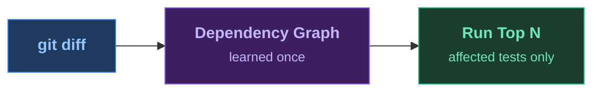

<SlideTitle />

<!--
PRESENTER CHECKLIST:
- Terminal font: 20pt+ (test on projector!)
- cloud-sdk-java built and index ready (./prepare.sh)
- VS Code open on cloud-sdk-java/, .github/copilot-instructions.md visible in a tab
- Dashboard tab open at localhost:8080 (mvn test-order:serve -pl cloudplatform/connectivity-destination-service)
- No Wi-Fi needed (all local)
- Timing: Title 20s → Pain 90s → HowItWorks 20s → Magic 30s → Results 15s → Dashboard 10s → AgenticDemo 75s → AgenticLoop 20s → Kicker 15s → Close 15s = ~5min

[click] subtitle appears
[click] show the four ecosystems we support — Java, JUnit 5, Maven, Gradle

→ Immediately to terminal for the pain demo.
-->

---
transition: fade
layout: full
---

<SlideHowItWorks>

</SlideHowItWorks>

<!--
[AFTER the pain demo — audience just watched 90s of tests run]

"That's what CI does on every push. Every PR. Every iteration."
"What if Maven knew which tests actually exercise the code you touched?"
"Learn the dependency graph once. Then select on every commit."

→ Run the magic demo now.
  cd cloud-sdk-java
  ./make-change.sh      ← introduces the tenant-routing bug + commits
  ./toggle-test-order.sh on
  mvn test-order:select test -pl cloudplatform/connectivity-destination-service
  → RED in ~17s
-->

---
transition: zoom
layout: full
---

<SlideResults />

<!--
[Tests failed — ~17 seconds]

"Seven test classes. 17 seconds. It found a bug."
"No clean rebuild. No guessing. It knows exactly which tests exercise this code."

→ Brief dashboard moment here (10s max):
  Switch to browser tab at localhost:8080
  "It didn't just run the right tests — it's been tracking every run.
   You can see which tests are most valuable. Observability over your test suite."
  Switch back immediately.

→ Now show Copilot fixing it. Stay in terminal or switch to VS Code.
  Show .github/copilot-instructions.md tab.
  "One file. It tells the agent: after every change, run test-order select."
-->

---
transition: fade
clicks: 7
layout: full
---

<SlideAgenticLoop />

<!--
[Back from VS Code — audience just watched Copilot read failure, fix, go green]

Click through to recap what they just saw:
[click 1] "The AI made a change — and introduced a bug."
[click 2] "test-order:select ran. The instructions file told Copilot to."
[click 3] "17 seconds: a test failed. Logic inversion in tenant routing."
[click 4] "Copilot read the failure and fixed the negation."
[click 5] "17 seconds again. Green."
[click 6] "Edit → caught → fixed → green. Under 40 seconds."
[click 7] "One instructions file. That's the entire integration."

LIVE PROMPT for Copilot chat:
  "The tests are failing. Read the failure output and fix the bug.
   After the fix, run the tests using the project's test instructions."

FALLBACK if Copilot doesn't cooperate:
  ./fix-change.sh                                                         # fix the negation
  mvn test-order:select test   # green ~17s
-->

---
transition: fade
layout: full
---

<SlideKicker />

<!--
Let this land. Pause. Then advance to the closing slide.
-->

---
transition: fade
layout: full
---

<SlideClose />

<!--
"Star the repo, drop in the plugin, and tell me how much time you saved."
"Thank you."
-->
