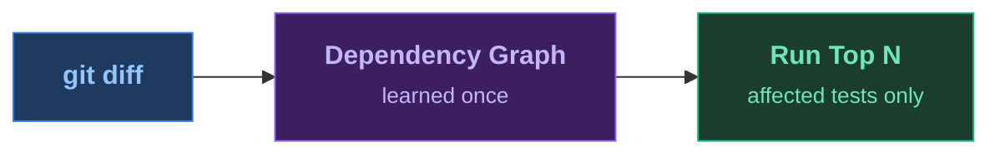
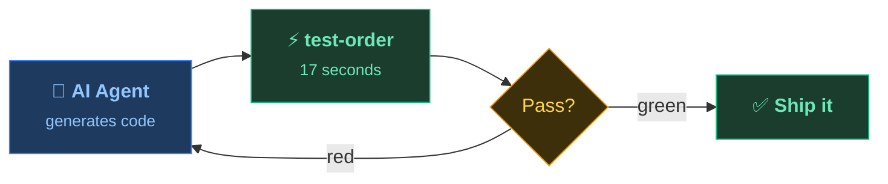

<SlideTitle />

<!--
PRESENTER CHECKLIST:
- Terminal font: 20pt+ (test on projector!)
- Have sample project ready with pre-built index
- No Wi-Fi needed (all local)
- Timing: Title 20s → Pain 90s → Reorder Anim 20s → Magic 75s → Results 10s → Transition 20s → Agentic 15s → AgenticDemo 75s → Close 30s = ~6min

[click] subtitle appears
[click] show the four ecosystems we support — Java, JUnit 5, Maven, Gradle
-->

---
transition: fade
layout: full
---

<SlideHowItWorks>

</SlideHowItWorks>

<!--
"What if we could know which tests are affected by a change?"
"Learn a dependency graph once, then select on every commit."

→ Immediately to terminal for the pain demo (3 min full run).
-->

---
transition: fade
clicks: 4
layout: full
---

<SlideTestSelection />

<!--
Click through:
1. Show the changed file (code diff)
2. Show which tests are connected to that code
3. Show the "3 instead of 8" label
4. Swap to reordered list (affected first, rest skipped)

"The plugin learned which tests exercise which code.
When you change DestinationService, it knows exactly which 3 tests to run."

→ Back to terminal for the magic 17-second demo.
-->

---
transition: zoom
layout: full
---

<SlideResults />

<!--
"You just saw it. Same change, same results, ten times faster."
"But this is just one developer. What about an AI agent iterating in a loop?"

→ Next slide sets up the agentic demo.
-->

---
transition: fade
layout: full
---

<SlideTransition />

<!--
Breathe. Let the contrast land.
"3 minutes per loop is death by a thousand cuts — for you, and for an AI agent."
"test-order turns that into 17 seconds. Same confidence, 10× the throughput."

→ Next slide: the agentic loop diagram.
-->

---
transition: slide-left
clicks: 3
layout: full
---

<SlideAgentic>

</SlideAgentic>

<!--
"An agent iterates: generate, test, fix, retry."
"3 minutes per loop kills the workflow. 17 seconds keeps it flowing."
"Let me show you — with a real AI making a real mistake."

→ Switch to VS Code for live agentic demo, then come back to next slide.
-->

---
transition: fade
clicks: 7
layout: full
---

<SlideAgenticLoop />

<!--
→ Switch to VS Code with cap-sflight open. Show copilot-instructions.md.

[click 1] "The AI makes a change — adding a discount validation."
[click 2] "Copilot runs test-order:select automatically — copilot-instructions.md told it to."
[click 3] "17 seconds later: a test fails. The validation is wrong — it rejects 50% instead of above 50%."
[click 4] "Copilot reads the failure, fixes the off-by-one."
[click 5] "17 seconds again. Green."
[click 6] "Edit → caught → fixed → green. Under 40 seconds total."
[click 7] "One instructions file. That's the only integration."

LIVE PROMPT for Copilot chat:
  "Add max discount validation to DeductDiscountHandler.
   Discounts above 50% should be rejected with an error message.
   After the change, run the tests using the project's test instructions."

Watch Copilot:
  1. Edit DeductDiscountHandler.java (introduce > 50 OR use >= 50 — either breaks a test)
  2. Run mvn test-order:select test -pl srv -Denforcer.skip=true
  3. DeductDiscountHandlerTest fails (17s)
  4. Copilot reads failure, fixes boundary condition
  5. Re-runs test-order:select — green (17s)

FALLBACK if Copilot doesn't auto-run tests:
  Show copilot-instructions.md — point to the mvn command — then run manually.

FALLBACK if Copilot succeeds first try (no bug):
  Say "it got it right — let me show what it looks like when it doesn't"
  then: sed -i '' 's/>= 50/> 50/' srv/src/main/java/.../DeductDiscountHandler.java
  then: mvn test-order:select test -pl srv -Denforcer.skip=true  (red, 17s)
  then: git diff  (show Copilot the diff)
  then: let Copilot fix it
-->

---
transition: fade
layout: full
---

<SlideKicker />

<!--
Let this land. Pause. Then advance to the closing slide.
-->

---
transition: fade
layout: full
---

<SlideClose />

<!--
"Star the repo, drop in the plugin, and tell me how much time you saved."
"Thank you."
-->
