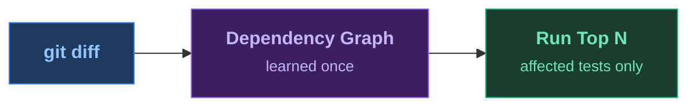

<SlideTitle />

<!--
PRESENTER CHECKLIST:
- Terminal font: 20pt+ (test on projector!)
- cloud-sdk-java built and index ready (./prepare.sh)
- VS Code open on cloud-sdk-java/, .github/copilot-instructions.md visible in a tab
- Dashboard tab open at localhost:8080 (mvn test-order:serve -pl cloudplatform/connectivity-destination-service)
- No Wi-Fi needed (all local)

TARGET TIMING:
  0:00  Title slide (20s)
  0:20  Pain — VS Code terminal, mvn clean test (2:00, killed)
  2:20  Magic — toggle + make-change + select (40s)
  3:00  Slide: Results 5:00→17s (20s)
  3:20  Slide: HowItWorks (30s)
  3:50  Browser: dashboard (15s)
  4:05  VS Code: Copilot fixes bug (80s)
  5:25  Slide: AgenticLoop (25s)
  5:50  Slide: Kicker — pause (20s)
  6:10  Slide: Close (10s)
  ─────────────────────────
  Total: ~6:20 (trim if needed by shortening Copilot narration or pain)

[click] subtitle + ecosystem icons appear together

"The most expensive thing in software delivery is waiting for feedback."

→ Switch to VS Code (already open on cloud-sdk-java). Terminal is visible.
  "SAP Cloud SDK for Java. The real thing. 65 modules."
-->

---
transition: zoom
layout: full
---

<SlideResults />

<!--
[Tests just failed — audience watched toggle + make-change + select go RED in ~17s]

[numbers animate in — 5:00+ left, 0:17 right]

"Seven test classes. Seventeen seconds. Build failure."

[beat — let the numbers sit]

"Not five minutes. Seventeen seconds."

[click — "Same change. Same confidence. 20× faster."]

"Same change. Same codebase. Twenty times faster. And it found the bug."

→ Advance to explain how.
-->

---
transition: fade
layout: full
---

<SlideHowItWorks>

</SlideHowItWorks>

<!--
"Here's what just happened."

You run a learn pass once. The plugin instruments your bytecode — no annotations, no JaCoCo,
no cloud — and records, for every test class, every production class it touches at runtime.
That's the dependency graph. Stored locally, ~500KB, fits in git. Survives across builds.

"One learn run. About 12% overhead — similar to checkstyle. That's it. You don't re-learn
until you refactor."

On every subsequent run: git diff tells us what changed. We intersect with the graph.
Tests that overlap the changed classes score higher. Tests that recently failed score higher.
Fast tests get a small bonus, slow ones a small penalty.
Select mode commits to running only the top N — the rest are deferred entirely.

[click — "One Maven plugin. Zero config. Let me show you."]

"Maven, Gradle, JUnit 5, JUnit 4, TestNG, Kotest — anything on the JUnit Platform.
Zero configuration. The plugin auto-detects your source packages."

→ Switch to browser tab at localhost:8080 (keep it brief — 15s)
  "And it's been tracking every run since we set it up."
  Point at: ranked test list with scores, Analytics tab (APFD trend, pass/fail run chips),
  "Which tests are your best early-warning signals. Which are flaky."
  "That number — APFD — is how early in the run failures surfaced. We want it high."
  Switch back to VS Code.

→ Show .github/copilot-instructions.md tab — one sentence, one command.
  "This is the entire AI integration. One file. Three lines."
  Read it aloud: "After every code change, run: mvn test-order:select test"
  "The agent gets test results in 17 seconds. Not 5 minutes."
  "And as a Gradle DevRel once put it: 2× slower feedback → 4× slower developer.
   An agent waiting 5 minutes makes 18× fewer fix attempts per hour."
  Close the tab. Type the prompt in Copilot chat.
-->

---
transition: fade
clicks: 4
layout: full
---

<SlideAgenticLoop />

<!--
[Back from VS Code — Copilot just fixed the negation, second run is green]

[click 1] "The AI made a change. Introduced a real bug — logic inversion in tenant routing."
[click 2] "test-order:select ran. 17 seconds. Bug caught."
[click 3] "Copilot read the stack trace. Fixed the negation. Ran again. Green."
[click 4] "Edit → caught → fixed → green. Under 40 seconds."

"One instructions file. Three lines. That's the entire integration."
"The bottleneck in AI-assisted development isn't intelligence — it's the wait."

→ Advance to kicker.
-->

---
transition: fade
layout: full
---

<SlideKicker />

<!--
[silence]

"Maybe your test suite isn't too large."

[pause — 3 full seconds]

[click] "Maybe you're just running the wrong tests first."

[pause — let it land. Don't advance immediately.]

"CI cache gives you fast compilation. This gives you fast signal.
The tests that can't possibly catch your change don't run at all."

[click — artifact appears] Drop in the plugin. That's it.
-->

---
transition: fade
layout: full
---

<SlideClose />

<!--
"Star it, drop in the plugin, and tell me how much time you saved."

[done — don't add anything. Walk off or take questions.]
-->
