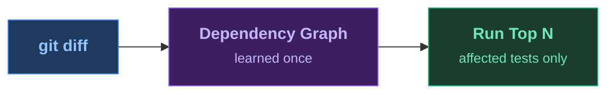
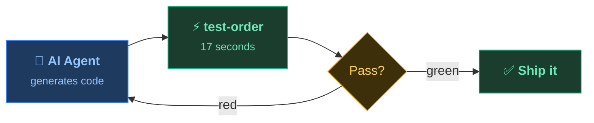

<!--
PRESENTER CHECKLIST:
- Terminal font: 20pt+ (test on projector!)
- Have sample project ready with pre-built index
- No Wi-Fi needed (all local)
- Timing: Title 15s → Pain 90s → Reorder Anim 20s → Magic 75s → Results 10s → Agentic 15s → AgenticDemo 75s → HowToUse+Close 30s = ~6min
-->

  <!-- Animated gradient orbs -->
  

  

  

  

    <h1 class="!text-6xl !font-bold !leading-tight bg-gradient-to-r from-blue-400 via-purple-400 to-emerald-400 bg-clip-text text-transparent">
      You Are Running the Wrong Tests First
    </h1>

    

      

        Predictive Test Ordering for Faster Feedback & Agentic Development
      

    

  

  

    
Johannes Bechberger

    
SAP DCOM 2026 · Demo Jam

  

  

    <svg width="80" height="80" viewBox="0 0 24 24" fill="none" stroke="url(#grad1)" stroke-width="1.5">
      <defs>
        <linearGradient id="grad1" x1="0%" y1="0%" x2="100%" y2="100%">
          <stop offset="0%" style="stop-color:#60a5fa"/>
          <stop offset="100%" style="stop-color:#34d399"/>
        </linearGradient>
      </defs>
      <path d="M12 2L2 7l10 5 10-5-10-5zM2 17l10 5 10-5M2 12l10 5 10-5"/>
    </svg>
  

<!--
"The most expensive thing in software delivery is waiting for feedback."

→ Immediately switch to terminal for the pain demo.
-->

---
transition: fade
---

  

  

    <h2 class="!text-5xl !font-bold !leading-snug text-white mb-12">
      What if we only ran the tests  
      that matter?
    </h2>
  

  

  

  

    

      

      One Maven plugin. Zero config. Let me show you.
    

  

<!--
"What if we could know which tests are affected by a change?"
"Learn a dependency graph once, then select on every commit."

→ Immediately to terminal for the pain demo (3 min full run).
-->

---
transition: fade
clicks: 4
---

  

  

    <h2 class="!text-3xl !font-bold text-white">
      How Test Selection Works
    </h2>
  

  

    <!-- Left: Changed code -->
    

      

        Changed file
        

          
// DestinationService.java

          
- return cache.get(name);

          
+ return cache.getOrFetch(name, this::resolve);

        

      

      

        Dependency graph knows:
        

          

            

            3 tests exercise this code path
          

          

            

            5 tests don't touch it at all
          

        

      

    

    <!-- Right: Test list with reordering -->
    

      Test execution order

      

        <!-- Before: alphabetical order -->
        

          

            1.
            AuthTokenProviderTest
          

          

            2.
            CacheConfigTest
          

          
= 2 ? 'border-emerald-500/40 bg-emerald-950/20' : 'border-white/10 bg-white/5'" class="flex items-center gap-3 border rounded-lg px-4 py-2.5 font-mono text-sm transition-all duration-500">
            3.
            = 2 ? 'text-emerald-300' : 'text-gray-300'" class="transition-colors duration-500">DestinationResolverTest
            = 2" class="ml-auto text-xs text-emerald-400 bg-emerald-400/10 px-2 py-0.5 rounded">calls changed code
          

          
= 2 ? 'border-emerald-500/40 bg-emerald-950/20' : 'border-white/10 bg-white/5'" class="flex items-center gap-3 border rounded-lg px-4 py-2.5 font-mono text-sm transition-all duration-500">
            4.
            = 2 ? 'text-emerald-300' : 'text-gray-300'" class="transition-colors duration-500">DestinationServiceTest
            = 2" class="ml-auto text-xs text-emerald-400 bg-emerald-400/10 px-2 py-0.5 rounded">calls changed code
          

          

            5.
            HttpClientFactoryTest
          

          
= 2 ? 'border-emerald-500/40 bg-emerald-950/20' : 'border-white/10 bg-white/5'" class="flex items-center gap-3 border rounded-lg px-4 py-2.5 font-mono text-sm transition-all duration-500">
            6.
            = 2 ? 'text-emerald-300' : 'text-gray-300'" class="transition-colors duration-500">OnPremiseProxyTest
            = 2" class="ml-auto text-xs text-emerald-400 bg-emerald-400/10 px-2 py-0.5 rounded">calls changed code
          

          

            7.
            RetryHandlerTest
          

          

            8.
            TenantIsolationTest
          

        

        <!-- After: reordered (affected first) -->
        

          

            1.
            DestinationResolverTest
            ★ affected
          

          

            2.
            DestinationServiceTest
            ★ affected
          

          

            3.
            OnPremiseProxyTest
            ★ affected
          

          

            4.
            AuthTokenProviderTest
            skipped
          

          

            5.
            CacheConfigTest
            skipped
          

          

            6.
            HttpClientFactoryTest
            skipped
          

          

            7.
            RetryHandlerTest
            skipped
          

          

            8.
            TenantIsolationTest
            skipped
          

        

      

    

  

  <!-- Bottom label -->
  

    

      3 tests instead of 8 → 10× faster feedback
    

  

<!--
Click through:
1. Show the changed file (code diff)
2. Show which tests are connected to that code
3. Show the "3 instead of 8" label
4. Swap to reordered list (affected first, rest skipped)

"The plugin learned which tests exercise which code.
When you change DestinationService, it knows exactly which 3 tests to run."

→ Back to terminal for the magic 17-second demo.
-->

---
transition: zoom
---

  <!-- Dramatic glow behind the numbers -->
  

  

  

    

      
3:03

      
before

    

    

      <svg class="w-12 h-12 text-gray-600" viewBox="0 0 24 24" fill="none" stroke="currentColor" stroke-width="2">
        <path d="M5 12h14M12 5l7 7-7 7"/>
      </svg>
    

    

      
0:17

      
after

    

  

  

    

      Same change. Same confidence.
      10× faster.
    

  

  

    

      Now imagine an AI agent doing this ten times in a row...
    

  

<!--
"You just saw it. Same change, same results, ten times faster."
"But this is just one developer. What about an AI agent iterating in a loop?"

→ Next slide sets up the agentic demo.
-->

---
transition: slide-left
clicks: 3
---

  

  

    <h2 class="!text-5xl !font-bold text-white">
      The Agentic Multiplier
    </h2>
  

  

  

  

    

      
3 min

      
kills the loop

    

    

      <svg class="w-8 h-8 text-gray-600" viewBox="0 0 24 24" fill="none" stroke="currentColor" stroke-width="2">
        <path d="M5 12h14M12 5l7 7-7 7"/>
      </svg>
    

    

      
17 sec

      
keeps it flowing

    

  

<!--
"An agent iterates: generate, test, fix, retry."
"3 minutes per loop kills the workflow. 17 seconds keeps it flowing."
"Let me show you."

→ Switch to VS Code for live agentic demo.
-->

---
transition: fade
---

  <!-- Ambient glow -->
  

  

    

      Maybe your test suite isn't too large.
    

    

      Maybe you're just running the wrong tests first.
    

  

  

    

      <code class="text-xl text-emerald-400 font-mono">me.bechberger:test-order-maven-plugin</code>
    

  

  

    

  

<!--
Let this land. Pause. Then advance to the how-to-use slide.
-->

---
transition: fade
clicks: 3
---

  

  

    <h2 class="!text-4xl !font-bold text-white">Get Started in 30 Seconds</h2>
  

  

    <!-- Left: Steps -->
    

      

        
1

        

          
Add to your pom.xml

          

            &lt;plugin&gt; 
            &nbsp;&nbsp;&lt;groupId&gt;me.bechberger&lt;/groupId&gt; 
            &nbsp;&nbsp;&lt;artifactId&gt;test-order-maven-plugin&lt;/artifactId&gt; 
            &lt;/plugin&gt;
          

        

      

      

        
2

        

          
First run learns dependencies

          

            $ mvn test
          

          
Instruments tests & builds dependency index

        

      

      

        
3

        

          
Every run after: fast feedback

          

            $ mvn test-order:select test
          

          
Runs only tests affected by your changes

        

      

    

    <!-- Right: QR code + links -->
    

      

        
      

      

        
github.com/parttimenerd/test-order

        

          

            
Maven

            <code class="text-emerald-400 text-xs">me.bechberger:test-order-maven-plugin</code>
          

        

        

          

            
Gradle

            <code class="text-emerald-400 text-xs">me.bechberger.test-order</code>
          

        

      

    

  

  

    Johannes Bechberger · SAP DCOM 2026
  

<!--
Leave this up while people take photos / scan the QR code.
"Add the plugin, run tests once to learn, then enjoy 10× faster feedback."
"Scan the QR code or find us on GitHub. Works with Maven and Gradle."
-->
