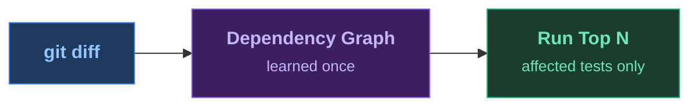

<SlideTitle />

<!--
PRESENTER CHECKLIST:
- Terminal font: 20pt+ (test on projector!)
- cloud-sdk-java built and index ready (./prepare.sh)
- VS Code open on cloud-sdk-java/, .github/copilot-instructions.md visible in a tab
- Dashboard tab open at localhost:8080 (mvn test-order:serve -pl cloudplatform/connectivity-destination-service)
- No Wi-Fi needed (all local)
- Timing: Title 20s → Pain 90s → Magic 30s → Results 15s → HowItWorks 25s → Dashboard 10s → AgenticDemo 75s → AgenticLoop 20s → Kicker 15s → Close 10s = ~5:30

[click] subtitle appears — "The most expensive thing in software delivery is waiting for feedback."
[click] ecosystem icons — "Maven, Gradle, JUnit 5, JUnit 4, TestNG, Kotest. Java 17+."

→ Immediately to terminal. Don't linger on this slide.
-->

---
transition: zoom
layout: full
---

<SlideResults />

<!--
[Tests just failed — audience watched make-change.sh + toggle + select run RED in ~17s]

"Seven test classes. 17 seconds. Build failure."
"Not five minutes. Seventeen seconds."
[click — 5:00+ → 0:17 numbers animate]
"Same change. Same confidence. Twenty times faster."

That's the whole bet. One plugin. No annotation changes. No test rewrites.
It found the bug — logic inversion in tenant routing — in 17 seconds because it already
knew which tests exercise that code path.

→ Now explain how. Advance to next slide.
-->

---
transition: fade
layout: full
---

<SlideHowItWorks>

</SlideHowItWorks>

<!--
"Here's what just happened."

You run a learn pass once. The plugin instruments your bytecode — no annotations, no JaCoCo,
no cloud — and records, for every test class, every production class it touches at runtime.
That's the dependency graph. Stored locally, compressed, survives across builds.
For this 65-module project the index is ~500KB. It fits in git.

On every subsequent run: git diff tells us what changed.
We intersect with the graph. Tests that overlap the changed classes score higher.
Tests that recently failed score higher. Fast tests get a small bonus, slow ones a small penalty.
The result is a ranked list. Select mode commits to running only the top N — the rest are deferred entirely.

"One learn run. About 12% overhead — similar to checkstyle. You don't re-run it until you refactor."
"Then every commit: 17 seconds instead of 5 minutes."

→ Brief dashboard moment (10s max):
  Switch to browser tab at localhost:8080
  "It didn't just run the right tests — it's been tracking every run."
  Point at: ranked list with scores, Analytics tab (APFD trend, pass/fail history), run diff
  "Which tests are your best early-warning signals. Which ones are flaky. How early bugs surface."
  Switch back to slides immediately.

→ Now switch to VS Code. Show .github/copilot-instructions.md tab — one sentence, one command.
  "This is the entire AI integration. One file."
-->

---
transition: fade
clicks: 4
layout: full
---

<SlideAgenticLoop />

<!--
[Back from VS Code — Copilot just read the failure, fixed the negation, ran green]

[click 1] "The AI made a change. Introduced a real bug — logic inversion in tenant routing."
[click 2] "test-order:select ran. 17 seconds. Bug caught."
[click 3] "Copilot read the stack trace. Fixed the negation. Ran again. Green."
[click 4] "Edit → caught → fixed → green. Under 40 seconds. One instructions file."

As a Gradle DevRel once put it: when your feedback loop takes 2× longer, you don't slow down 2×
— you slow down 4×. An agent waiting 5 minutes makes 18× fewer fix iterations per hour
than one getting feedback in 17 seconds. The bottleneck isn't intelligence. It's the wait.

LIVE PROMPT for Copilot chat:
  "The tests are failing. Read the failure output and fix the bug.
   After the fix, run the tests using the project's test instructions."

FALLBACK if Copilot doesn't cooperate:
  ./fix-change.sh             # fix the negation
  mvn test-order:select test  # green ~17s
-->

---
transition: fade
layout: full
---

<SlideKicker />

<!--
"Maybe your test suite isn't too large."
[pause — let it sit]
[click] "Maybe you're just running the wrong tests first."

If anyone's thinking "I already have a CI cache" — CI cache gives you fast compilation.
This gives you fast *signal*. You've skipped the tests that can't possibly catch your change.
And unlike hand-curated smoke sets, this one is learned from actual execution
— it stays accurate as the codebase evolves.

[click — artifact appears] Drop in the plugin. That's it.
-->

---
transition: fade
layout: full
---

<SlideClose />

<!--
"Star it, drop in the plugin, and tell me how much time you saved."
-->
