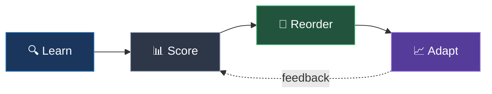

<!--
⚠️ PRESENTER CHECKLIST (delete this before exporting PDF):
- Run ./setup-all.sh at least 30 min before presentation
- Terminal font: 18pt+ (test on projector!)
- Verify: ./run-legacy-demo.sh shows "Estimated time saved: ~21s"
- Verify: ./run-vibe-demo.sh shows "Estimated time saved: ~24s"
- Fallback: if live demo fails, run with --replay flag
- Network: no Wi-Fi needed (all local)
- Timing budget: Slides ~3min + Demo 1 ~1.5min + Demo 2 ~1.5min = 6min
-->

# Smarter CI

## From Legacy Maintenance to Vibe Coding

<div class="mt-16 text-xl text-gray-400">
  SAP d-kom 2026
</div>

<div class="abs-br m-6">
  <div class="text-sm opacity-50">Johannes Bechberger</div>
</div>

<!--
Opening: "Hands up if you've ever pushed a one-line fix and waited 20 minutes for CI."
-->

---
layout: center
---

# The Problem

<div class="mt-12 flex items-center justify-center gap-16">

<div class="text-center">
  <div class="text-8xl mb-6">🐢</div>
  <div class="text-5xl font-bold text-red-400">21 seconds</div>
  <div class="text-xl text-gray-400 mt-4">waiting for the right test to run</div>
</div>

</div>

<div class="mt-16 flex justify-center">
  <div class="bg-red-900/30 border border-red-500/50 rounded-xl px-8 py-4 text-center">
    <div class="text-lg text-red-300">Default order: alphabetical</div>
    <div class="text-sm text-gray-400 mt-1">The test that catches your bug runs <strong class="text-red-400">last</strong></div>
  </div>
</div>

<!--
Whether it's a legacy CVE fix or AI-generated code — same problem.
The test that matters runs LAST in alphabetical order.
-->

---
layout: center
class: text-center
---

# Demo 1: Legacy CVE Fix

<div class="mt-8 flex items-center justify-center gap-4">
  <div class="text-5xl">🏗️</div>
  <div class="text-5xl">→</div>
  <div class="text-5xl">🔧</div>
  <div class="text-5xl">→</div>
  <div class="text-5xl">⏳</div>
</div>

<div class="mt-10 bg-gray-800/80 rounded-xl p-6 max-w-lg mx-auto text-left">
  <div class="font-mono text-sm space-y-2">
    <div><span class="text-gray-500">Project:</span> Apache Olingo OData2</div>
    <div><span class="text-gray-500">Change:</span> Remove one null-check (CVE fix)</div>
    <div><span class="text-gray-500">Tests:</span> 7 classes, ~21s total</div>
    <div><span class="text-gray-500">Bug in:</span> <span class="text-red-400">UriParserImplTest</span> — alphabetically <strong>last</strong></div>
  </div>
</div>

<div class="mt-8 font-mono text-lg text-green-400">
  $ ./run-legacy-demo.sh
</div>

<!--
Switch to terminal: run-legacy-demo.sh
Press Enter for "without test-order" — watch tests pass one by one, failure at end.
Press Enter for "with test-order" — failure at position 1. Instant.
-->

---
layout: center
---

# How?

<div class="mt-8">



</div>

<div class="grid grid-cols-4 gap-6 mt-10">

<div class="text-center">
  <div class="w-16 h-16 mx-auto bg-blue-900/50 rounded-full flex items-center justify-center text-2xl mb-3">🔍</div>
  <div class="font-bold text-blue-300 text-sm">Learn</div>
  <div class="text-xs text-gray-400 mt-1">Java Agent records<br/>test → source deps</div>
</div>

<div class="text-center">
  <div class="w-16 h-16 mx-auto bg-gray-700/50 rounded-full flex items-center justify-center text-2xl mb-3">📊</div>
  <div class="font-bold text-gray-300 text-sm">Score</div>
  <div class="text-xs text-gray-400 mt-1">Rank by change<br/>overlap + failures</div>
</div>

<div class="text-center">
  <div class="w-16 h-16 mx-auto bg-green-900/50 rounded-full flex items-center justify-center text-2xl mb-3">🏃</div>
  <div class="font-bold text-green-300 text-sm">Reorder</div>
  <div class="text-xs text-gray-400 mt-1">JUnit ClassOrderer<br/>runs best tests first</div>
</div>

<div class="text-center">
  <div class="w-16 h-16 mx-auto bg-purple-900/50 rounded-full flex items-center justify-center text-2xl mb-3">📈</div>
  <div class="font-bold text-purple-300 text-sm">Adapt</div>
  <div class="text-xs text-gray-400 mt-1">Gets smarter<br/>every run</div>
</div>

</div>

<div class="mt-8 text-center">
  <div class="inline-block bg-gray-800 rounded-lg px-6 py-3 font-mono text-sm">
    score = <span class="text-blue-300">changeOverlap</span> + <span class="text-purple-300">failRecency</span> + <span class="text-green-300">newTestBonus</span> ± <span class="text-gray-300">speed</span>
  </div>
  <div class="text-xs text-gray-500 mt-2">Key signal: "does this test exercise code you just changed?"</div>
</div>

<!--
The key signal: "does this test exercise code that you just changed?"
Java Agent does bytecode instrumentation — zero source changes needed.
First run already works: uses static code dependencies. No historical data needed.
-->

---
layout: center
class: text-center
---

# Demo 2: Vibe Coding Gone Wrong

<div class="mt-8 flex items-center justify-center gap-4">
  <div class="text-5xl">🤖</div>
  <div class="text-5xl">→</div>
  <div class="text-5xl">✨</div>
  <div class="text-5xl">→</div>
  <div class="text-5xl">🐛</div>
</div>

<div class="mt-10 bg-gray-800/80 rounded-xl p-6 max-w-xl mx-auto">
  <div class="text-left space-y-3">
    <div class="flex gap-3 items-start">
      <span class="text-green-400 font-mono text-sm shrink-0">AI prompt:</span>
      <span class="text-gray-300">"Add VIP discount — 20% off for 100k+ miles"</span>
    </div>
    <div class="flex gap-3 items-start">
      <span class="text-red-400 font-mono text-sm shrink-0">AI wrote:</span>
      <span class="font-mono text-sm text-red-300">price.subtract(BigDecimal.valueOf(20))</span>
    </div>
    <div class="flex gap-3 items-start">
      <span class="text-green-400 font-mono text-sm shrink-0">Correct:</span>
      <span class="font-mono text-sm text-green-300">price.multiply(BigDecimal.valueOf(0.80))</span>
    </div>
  </div>
</div>

<div class="mt-8 font-mono text-lg text-green-400">
  $ ./run-vibe-demo.sh
</div>

<!--
Switch to terminal: run-vibe-demo.sh
VipDiscountTest runs FIRST with test-order. Bug caught in <1s instead of 24s.
-->

---
layout: center
---

<div class="text-center">

<div class="flex items-center justify-center gap-8 mb-8">
  <div>
    <div class="text-6xl font-bold text-red-400 line-through opacity-60">24s</div>
    <div class="text-sm text-gray-500 mt-1">without</div>
  </div>
  <div class="text-4xl text-gray-600">→</div>
  <div>
    <div class="text-6xl font-bold text-green-400">&lt;1s</div>
    <div class="text-sm text-gray-500 mt-1">with test-order</div>
  </div>
</div>

<div class="text-2xl text-gray-300 mb-12">
  on a tiny 7-class project
</div>

<div class="bg-gray-800/80 rounded-xl p-8 max-w-md mx-auto">
  <div class="space-y-4 text-left text-xl">
    <div class="flex justify-between">
      <span class="text-gray-400">7 classes</span>
      <span class="text-amber-400 font-bold">~24s saved</span>
    </div>
    <div class="flex justify-between">
      <span class="text-gray-400">70 classes</span>
      <span class="text-amber-300 font-bold">~3–4 min saved</span>
    </div>
    <div class="flex justify-between">
      <span class="text-gray-400">700 classes</span>
      <span class="text-amber-200 font-bold">~30–40 min saved</span>
    </div>
  </div>
  <div class="text-xs text-gray-500 mt-4 text-center">Worst case: bug in last-alphabetical test. Actual savings vary.</div>
</div>

</div>

<!--
Let them do the math. Linear scaling assumption for large monoliths.
"How much time does YOUR team waste waiting for the right test?"
If asked: APFD = Average Percentage of Faults Detected — how early in the 
test run you catch bugs. 92.9% means near-optimal ordering.
-->

---
layout: center
---

# Get Started

<div class="mt-6 bg-gray-800/80 rounded-xl p-6 max-w-lg mx-auto">

```xml
<plugin>
  <groupId>me.bechberger</groupId>
  <artifactId>test-order-maven-plugin</artifactId>
  <version>0.0.1-SNAPSHOT</version>
  <executions>
    <execution>
      <goals><goal>prepare</goal></goals>
    </execution>
  </executions>
</plugin>
```

</div>

<div class="mt-6 flex justify-center gap-10">

<div class="text-center">
  <div class="w-16 h-16 mx-auto bg-green-900/40 border border-green-500/30 rounded-full flex items-center justify-center text-2xl mb-2">🚀</div>
  <div class="font-bold text-sm">Zero config</div>
  <div class="text-xs text-gray-400">Works on first run</div>
</div>

<div class="text-center">
  <div class="w-16 h-16 mx-auto bg-blue-900/40 border border-blue-500/30 rounded-full flex items-center justify-center text-2xl mb-2">🔓</div>
  <div class="font-bold text-sm">Open source</div>
  <div class="text-xs text-gray-400">Apache 2.0</div>
</div>

<div class="text-center">
  <div class="w-16 h-16 mx-auto bg-purple-900/40 border border-purple-500/30 rounded-full flex items-center justify-center text-2xl mb-2">🤖</div>
  <div class="font-bold text-sm">Agent-ready</div>
  <div class="text-xs text-gray-400">No config for new tests</div>
</div>

</div>

<div class="mt-6 text-center">
  <div class="text-sm text-gray-400">
    <strong class="text-gray-300">Works with:</strong> JUnit 5/6 · TestNG · Kotest · Maven · Gradle · Multi-module
  </div>
</div>

<div class="mt-4 text-center">
  <div class="inline-block bg-gray-800 rounded-lg px-6 py-3">
    <span class="text-gray-400">GitHub:</span>
    <span class="font-mono text-white ml-2">github.com/parttimenerd/test-order</span>
  </div>
</div>

<!--
That's the whole setup. No annotations, no cloud service, no config files.
First run uses static dependency analysis (Java Agent). Gets smarter every run after.
"Add the plugin, run mvn test. Done."
-->
