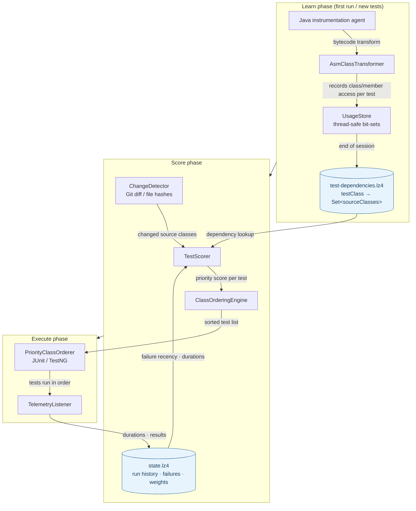
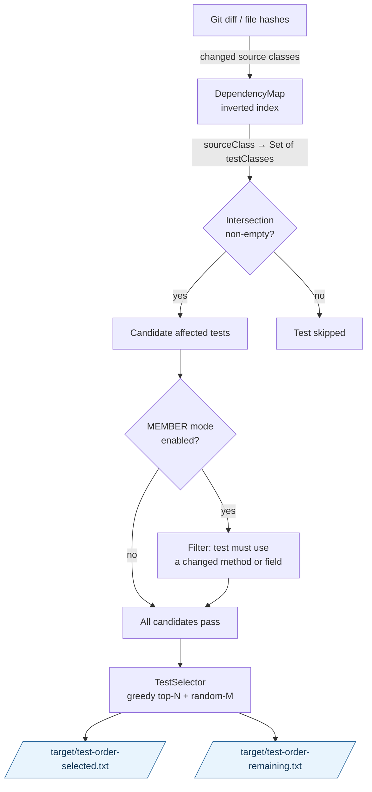

# test-order Architecture

This document describes the system at a stable, conceptual level.
It intentionally avoids low-level implementation details.

## System Purpose

test-order improves feedback speed by running the tests most likely to fail first,
based on code changes and historical run data.

## Core Data Flow

## Core Flow

1. Learn or load test-to-code dependency data.
2. Detect changed source classes.
3. Score tests by relevance.
4. Select a subset (or full set) depending on goal.
5. Execute tests in priority order.
6. Persist run outcomes to improve future scoring.

## Main Building Blocks

### Dependency Knowledge

- Stores which source classes are exercised by each test class.
- Used to estimate which tests are relevant for a given code change.
- Persisted under `.test-order/` to be reused across runs.

### Change Detection

- Supports automatic and explicit strategies.
- Works in local workflows and CI/CD.
- Produces a set of changed source classes.

### Scoring and Selection

- Assigns each test a priority score.
- Combines signals like overlap with changed code, failure recency, and runtime characteristics.
- `auto` mode typically runs a top-ranked subset plus optional diversity sampling.

### Runtime Integrations

- Maven plugin goals orchestrate learn/select/order/report workflows.
- JUnit/TestNG integrations apply class/method ordering where enabled.

### State and History

- Persists durations, failures, and run history in `.test-order/state.lz4`.
- Historical data allows adaptive prioritization over time.

### ML Predictions (Optional)

- When enabled (`testorder.ml.enabled=true`), collects per-test outcomes into `.test-order/ml/history.lz4`.
- After sufficient history (5+ runs), trains a logistic regression model to predict P(fail) per test.
- `TestHealthAnalyzer` classifies tests as HEALTHY, DEGRADING, FLAKY, or FAILING.
- Results surface in the `show` goal and dashboard (ML Health tab).
- All computation is local — no external services.

## Affected-Test Selection

`mvn test-order:affected test` (or `./gradlew testOrderAffected`) skips tests
that cannot be affected by recent changes, reducing suite execution to just the
relevant subset.

See [CLI Reference → affected goal](./CLI_REFERENCE.mdx) for configuration options.

## Data Produced

Common outputs include:

- `.test-order/test-dependencies.lz4`
- `.test-order/state.lz4`
- `.test-order/hashes.lz4` (and related hash snapshots)
- `.test-order/ml/history.lz4` (ML history, when enabled)
- `target/test-order-selected.txt`
- `target/test-order-remaining.txt`
- dashboard and coverage reports under `target/`

## Design Principles

- Fast feedback first, without removing the option to run the full suite.
- Safe defaults with explicit override controls.
- Incremental reuse of previous run knowledge.
- CI-friendly, reproducible behavior through explicit modes and seeds.

## What This Document Does Not Cover

To keep architecture guidance stable, this document does not track:

- concrete class-by-class internals
- low-level internal mechanics
- frontend component trees
- test fixture implementation details

Use source code and module-local docs when implementation details are needed.

## Extension and Contribution Guidance

Most users should treat test-order as a configured tool rather than an embedded framework.
For long-term maintainability, prefer configuration-driven customization first.

### Customize before extending code

Use built-in controls before adding custom code:

- change detection mode (`testorder.changeMode`)
- explicit changed class contract (`testorder.changed.classes`)
- selection size (`testorder.affected.topN`, `testorder.affected.randomM`)
- instrumentation scope (`testorder.includePackages`)
- scoring overrides (`testorder.score.*` and weights file)

### Safe contribution model

When configuration is not enough:

1. Document the use case and expected behavior.
2. Add tests describing the behavior contract.
3. Implement within the appropriate module.
4. Update docs with user-facing behavior (not internal-only details).

Good extension candidates:

- new change-detection integrations for CI environments
- additional scoring signals with clear opt-in behavior
- new report/export formats
- new command-level workflows composed from existing primitives

Avoid:

- coupling external systems directly to internal classes
- depending on non-documented internals as a public API
- hardcoding project-specific assumptions into shared defaults
