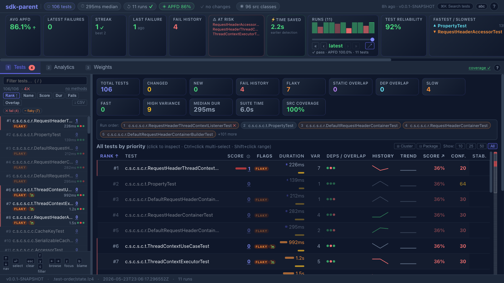

# Getting Started with test-order

This tutorial walks you through using test-order from scratch. By the end, you'll have tests running in priority order with affected tests surfacing first.

**Time required:** ~5 minutes.

## Prerequisites

- **Java 17+** installed
- **Maven 3.6+** or **Gradle 7.6+**
- A **Git** repository (test-order uses Git to detect changes)
- A project with **JUnit 5/6**, **TestNG 7.x+**, or **Kotest** tests

Quick check:
```bash
bash scripts/check_prerequisites.sh   # or just verify manually:
java -version && mvn --version && git --version
```

---

## Step 1: Add the plugin

### Maven

Add to your `pom.xml` inside `<build><plugins>`:

```xml
<plugin>
  <groupId>me.bechberger</groupId>
  <artifactId>test-order-maven-plugin</artifactId>
  <version>0.0.1-SNAPSHOT</version>
  <extensions>true</extensions>  <!-- required: registers the lifecycle participant that writes the index -->
  <executions>
    <execution>
      <goals><goal>prepare</goal></goals>
    </execution>
  </executions>
</plugin>
```

### Gradle

Add to your `build.gradle`:

```groovy
plugins {
    id 'me.bechberger.test-order' version '0.0.1-SNAPSHOT'
}
```

> **Settings:** If using a SNAPSHOT or local build, add `mavenLocal()` to your `pluginManagement.repositories` in `settings.gradle`.

> **Warning:** Adding `mavenLocal()` to project repositories can cause **"Failed to load JUnit Platform"** errors
> when stale JUnit JARs in `~/.m2` shadow your project's versions. Prefer the **init script** approach below
> to avoid this — it isolates `mavenLocal()` to the plugin classpath only.

<details>
<summary><b>Alternative: Gradle init script (no build file changes)</b></summary>

If you want to try test-order without modifying any build files, save this as `test-order-init.gradle`:

```groovy
initscript {
    repositories {
        mavenLocal()
        mavenCentral()
    }
    dependencies {
        classpath 'me.bechberger:test-order-gradle-plugin:0.0.1-SNAPSHOT'
    }
}

projectsLoaded {
    allprojects { project ->
        if (project.buildFile.absolutePath.contains('buildSrc')) return
        project.plugins.withId('java') {
            project.apply plugin: me.bechberger.testorder.gradle.TestOrderPlugin
        }
    }
}
```

Then run any Gradle command with `--init-script path/to/test-order-init.gradle`.

</details>

---

## Step 2: Run tests (learn mode)

On the first run, the plugin automatically enters **learn mode** — it pre-instruments your compiled classes (offline CLASS instrumentation, the default) so that each test's application-class dependencies are recorded without needing a Java agent attached at runtime.

```bash
# Maven
mvn test

# Gradle
./gradlew test
```

**What you'll see:**

```
[INFO] [test-order] Auto-instrumenting classes for offline learn mode: .../target/classes
[INFO] [test-order] Instrumented 42 classes (skipped 0)
[INFO] [test-order] Offline learn mode (CLASS): no agent, using pre-instrumented classes
[INFO] [test-order] IndexCollectorServer started on port 54321 (v2 binary protocol enabled)
[INFO] [test-order] IndexCollectorServer merged 8 test classes via socket
[INFO] BUILD SUCCESS
```

After the learn run, the dependency index is written to `.test-order/test-dependencies.lz4`. You can gitignore this directory — the plugin auto-learns on the first run for any new checkout.

> **Instrumentation modes:** The default is `offline` (pre-instrumented bytecode, no agent needed).
> To use online agent-based instrumentation instead, pass `-Dtestorder.instrumentation=online`.
> Online mode requires the agent JAR on the command line but avoids modifying bytecode on disk.

---

## Step 3: Make a change and re-run

Edit a source file — for example, modify a method in one of your service classes. Then run tests again:

```bash
# Maven
mvn test

# Gradle
./gradlew test
```

**What you'll see:**

```
[INFO] [test-order] Order mode — 2 changed classes detected (uncommitted)
[INFO] [test-order] Reordered 8 test classes by priority score
[INFO] Running com.example.ServiceTest        ← runs first (exercises changed code)
[INFO] Running com.example.ControllerTest     ← second priority
[INFO] Running com.example.UtilTest           ← unrelated, runs last
...
[INFO] BUILD SUCCESS
```

Tests that exercise your changed code now run first. If something breaks, you'll know within seconds — not after the full suite completes.

---

## Step 4: Inspect the prioritization

See exactly how tests are ranked:

```bash
# Maven
mvn test-order:show

# Gradle
./gradlew testOrderShow
```

**Example output:**

```
 # │ Score │ Class                           │ Reason
───┼───────┼─────────────────────────────────┼──────────────────────────
 1 │  14.0 │ com.example.ServiceTest         │ dep-overlap=5, changed-test=9
 2 │   5.0 │ com.example.ControllerTest      │ dep-overlap=5
 3 │   1.0 │ com.example.UtilTest            │ speed-bonus=1
 4 │   0.0 │ com.example.IntegrationTest     │ (no signal)
```

---

## Step 5: View the dashboard

Generate an interactive HTML report:

```bash
# Maven — live server (recommended; auto-reloads on each test run)
mvn test-order:serve

# Maven — write static file
mvn test-order:dashboard
open target/test-order-dashboard/index.html

# Gradle
./gradlew testOrderDashboard
open build/test-order-dashboard/index.html
```



The dashboard has three tabs:

- **Tests** — ranked list of all test classes with score breakdown, run history sparklines, and a detail panel showing per-run pass/fail, position history, similar tests, and source dependencies.
- **Analytics** — APFD timeline across all runs, per-run drill-down (failures, rank changes, diffs vs previous run), rank heatmap, failure correlation matrix, time budget optimizer, and 15+ further analysis panels. Use `←`/`→` to navigate between runs.
- **Weights** — tune the five scoring components and instantly preview how ranks change. Share configurations via URL hash.

The **KPI bar** at the top shows APFD, latest failures, pass streak, clean-run count, at-risk tests, estimated time savings, and a suite health grade (A–F). The run history sparkline lets you browse past runs without leaving the page.

Full feature reference: [../test-order-dashboard/README.md](../test-order-dashboard/README.md)

---

## Step 6: Diagnose issues

If something doesn't look right:

```bash
# Maven
mvn test-order:diagnose

# Gradle
./gradlew testOrderDiagnose
```

This checks index health, agent attachment, framework detection, and configuration issues.

---

## .gitignore

The simplest setup — just gitignore everything (the plugin auto-learns on first run):

```gitignore
.test-order/
target/test-order-dashboard/
build/test-order-dashboard/
```

If your learn run is slow and you want to share the index, commit `.test-order/test-dependencies.lz4` and only gitignore the rest.

---

## Try it hands-on

The project includes sample projects you can experiment with immediately:

```bash
# Clone and build test-order (see docs/DEVELOPMENT.md for details)
git clone https://github.com/parttimenerd/test-order.git
cd test-order
mvn install -DskipTests -Dspotless.check.skip=true

# Run the basic sample
cd samples/sample-basic
mvn test                  # learns dependencies
mvn test                  # reorders tests
mvn test-order:show       # inspect rankings

# Try the realistic shopping app sample
cd ../sample-shop
mvn test
mvn test-order:dashboard
```

> **Note:** The `-Dspotless.check.skip=true` flag is only needed when building
> the test-order framework itself (it runs code formatting checks). The sample
> projects don't need it.

---

## Next steps

| Goal | Guide |
|------|-------|
| Set up CI with tiered testing | [docs/ci-examples/](ci-examples/) |
| Configure multi-module projects | [docs/MULTI_MODULE_SETUP.md](MULTI_MODULE_SETUP.md) |
| Tune scoring weights | [docs/SCORING.md](SCORING.md) |
| Enable ML failure predictions | [docs/MAVEN_PLUGIN.md](MAVEN_PLUGIN.md) (ML section) |
| Detect order-dependent (flaky) tests | [docs/DETECT_DEPENDENCIES.md](DETECT_DEPENDENCIES.md) |
| Build from source / contribute | [docs/DEVELOPMENT.md](DEVELOPMENT.md) |
| Full CLI & properties reference | [docs/CLI_REFERENCE.md](CLI_REFERENCE.md) |

---

## Uninstalling

test-order makes no permanent changes to your project. To remove it completely:

1. Remove the plugin from your `pom.xml` (or `build.gradle`)
2. Delete the state directory: `rm -rf .test-order/`
3. Remove the `.test-order/` entry from `.gitignore` if you added one

Your tests will immediately go back to their default execution order.
