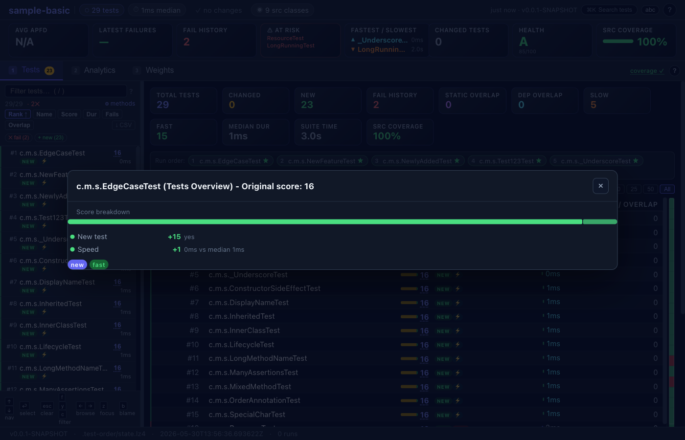
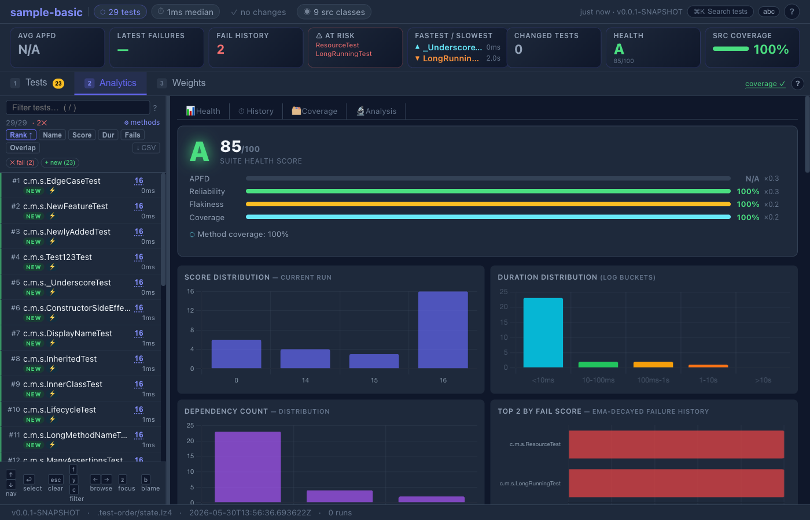
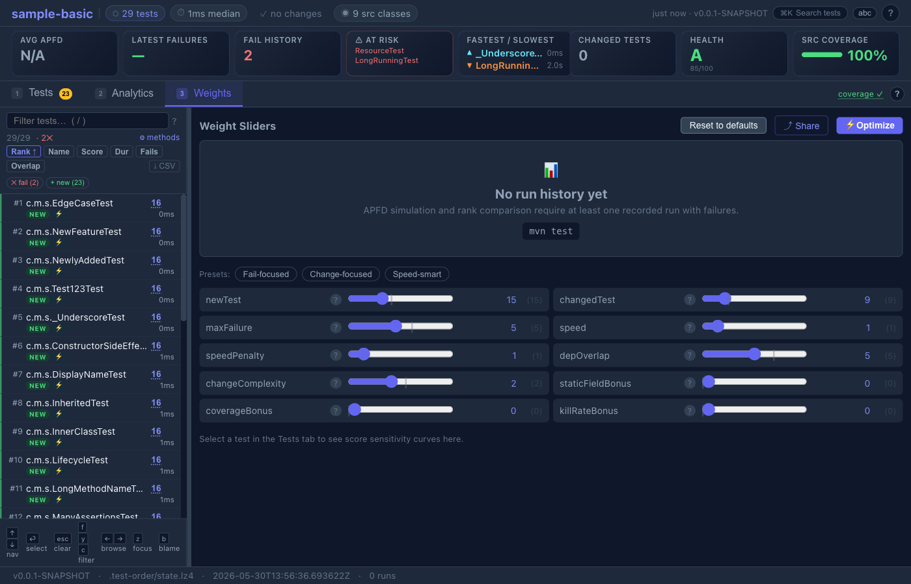

# Getting Started with test-order

import AsciinemaPlayer from '@site/src/components/AsciinemaPlayer';

This tutorial walks you through using test-order from scratch. By the end, you'll have tests running in priority order with affected tests surfacing first.

**Time required:** ~5 minutes.

<AsciinemaPlayer src="/casts/demo-hello-world.cast" cols={120} rows={28} />

## Prerequisites

- **Java 17+** installed (tested in CI on LTS releases 17, 21, 25 and current 27)
- **Maven 3.8+** or **Gradle 7.6+**
- A **Git** repository (recommended; the default `uncommitted` change-detection mode uses git. Non-git projects can use `changeMode=since-last-run` instead.)
- A project with **JUnit 5/6**, **TestNG 7.x+**, or **Kotest** tests

> **Using TestNG?** The setup is the same — add the plugin and run `mvn test`. The TestNG integration module (`test-order-testng`) is included automatically. See [test-order-testng/README.md](https://github.com/parttimenerd/test-order/blob/main/test-order-testng/README.md) for TestNG-specific behaviour, or [FRAMEWORK_COMPARISON.md](FRAMEWORK_COMPARISON.md) for a side-by-side comparison with JUnit 5.

Quick check:
```bash
bash scripts/check_prerequisites.sh   # or just verify manually:
java -version && mvn --version && git --version
```

---

## Step 1: Add the plugin

### Maven

First, add the Sonatype snapshot repository to your `pom.xml` so Maven can resolve the `0.0.1-SNAPSHOT` artifact:

```xml
<repositories>
  <repository>
    <id>ossrh-snapshots</id>
    <url>https://central.sonatype.com/repository/maven-snapshots/</url>
    <snapshots><enabled>true</enabled></snapshots>
  </repository>
</repositories>
<pluginRepositories>
  <pluginRepository>
    <id>ossrh-snapshots</id>
    <url>https://central.sonatype.com/repository/maven-snapshots/</url>
    <snapshots><enabled>true</enabled></snapshots>
  </pluginRepository>
</pluginRepositories>
```

Then add the plugin inside `<build><plugins>`:

```xml
<plugin>
  <groupId>me.bechberger</groupId>
  <artifactId>test-order-maven-plugin</artifactId>
  <version>0.0.1-SNAPSHOT</version>
  <extensions>true</extensions>  <!-- required: lets the plugin participate in Maven's lifecycle resolution.
                                       Without it, prepare can't auto-bind to process-test-classes and learn mode
                                       silently does nothing — the most common "Wrote fallback payloads" cause.
                                       See CHEAT_SHEET.md (Troubleshooting) if you hit that message. -->
  <executions>
    <execution>
      <goals><goal>prepare</goal></goals>
    </execution>
  </executions>
</plugin>
```

> **Tip — one-time settings.xml change:** Add `me.bechberger` to `~/.m2/settings.xml` once to enable the short `mvn test-order:show` prefix instead of typing the full group ID every time:
>
> ```xml
> <settings>
>   <pluginGroups>
>     <pluginGroup>me.bechberger</pluginGroup>
>   </pluginGroups>
> </settings>
> ```

### Gradle

Add the Sonatype snapshot repository to `settings.gradle` so Gradle can resolve the plugin:

```groovy
pluginManagement {
    repositories {
        maven {
            url 'https://central.sonatype.com/repository/maven-snapshots/'
            mavenContent { snapshotsOnly() }
        }
        gradlePluginPortal()
    }
}
```

Then add to your `build.gradle`:

```groovy
plugins {
    id 'me.bechberger.test-order' version '0.0.1-SNAPSHOT'
}
```

> **Warning — Gradle snapshot repository placement:** Do not add the snapshot repository to your project's regular `repositories {}` block — only to `pluginManagement.repositories {}`. Adding it to project repositories can expose snapshot JARs for your dependencies and cause **"Failed to load JUnit Platform"** errors when stale JARs shadow your project's versions.

<details>
<summary><b>Alternative: Gradle init script (no build file changes)</b></summary>

If you want to try test-order without modifying any build files, save this as `test-order-init.gradle`:

```groovy
initscript {
    repositories {
        maven {
            url 'https://central.sonatype.com/repository/maven-snapshots/'
        }
        gradlePluginPortal()
    }
    dependencies {
        classpath 'me.bechberger:test-order-gradle-plugin:0.0.1-SNAPSHOT'
    }
}

projectsLoaded {
    allprojects { project ->
        if (project.buildFile.absolutePath.contains('buildSrc')) return
        project.plugins.withId('java') {
            project.apply plugin: me.bechberger.testorder.gradle.TestOrderPlugin
        }
    }
}
```

Then run any Gradle command with `--init-script path/to/test-order-init.gradle`.

</details>

---

## Step 2: Run tests (learn mode)

On the first run, the plugin automatically enters **learn mode**. In the default `offline` instrumentation mode, the plugin modifies your compiled classes at build time to record which source classes each test exercises. A lightweight collector server receives these recordings during the test run and writes the dependency index.

```bash
# Maven
mvn test

# Gradle
./gradlew test
```

**What you'll see:**

```
[INFO] [test-order] Auto-instrumenting classes for offline learn mode: .../target/classes
[INFO] [test-order] Instrumented 42 classes (skipped 0)
[INFO] [test-order] Offline learn mode (MEMBER): using pre-instrumented classes
[INFO] [test-order] IndexCollectorServer started on port 54321 (v2 binary protocol enabled)
[INFO] [test-order] IndexCollectorServer merged 8 test classes via socket
[INFO] BUILD SUCCESS
```

After the learn run, the dependency index is written to `.test-order/test-dependencies.lz4`. You can gitignore this directory — the plugin auto-learns on the first run for any new checkout.

> **Instrumentation modes:** The default is `offline` (build-time bytecode instrumentation — the plugin modifies compiled classes before tests run, no `-javaagent` flag needed on the test JVM).
> To use online instrumentation instead (agent attached at runtime via `-javaagent`), pass `-Dtestorder.instrumentation=online`.
> Online mode avoids modifying bytecode on disk but requires the agent JAR to be locatable on the classpath.
> Both modes report dependency data through the same `IndexCollectorServer`.

<AsciinemaPlayer src="/casts/demo-learn.cast" cols={120} rows={28} />

---

## Step 3: Make a change and re-run

Edit a source file — for example, modify a method in one of your service classes. Then run tests again:

```bash
# Maven
mvn test

# Gradle
./gradlew test
```

**What you'll see:**

```
[INFO] [test-order] Order mode — 2 changed classes detected (uncommitted)
[INFO] [test-order] Reordered 8 test classes by priority score
[INFO] Running com.example.ServiceTest        ← runs first (exercises changed code)
[INFO] Running com.example.ControllerTest     ← second priority
[INFO] Running com.example.UtilTest           ← unrelated, runs last
...
[INFO] BUILD SUCCESS
```

Tests that exercise your changed code now run first. If something breaks, you'll know within seconds — not after the full suite completes.

---

## Step 4: Inspect the prioritization

> **Note — `show` requires a learn run first:** `show` reads the dependency index, so it requires a prior learn run to have happened. If you see "no index found", run `mvn test` (or `mvn -Dtestorder.mode=learn test`) once first.

See exactly how tests are ranked:

```bash
# Maven
mvn test-order:show

# Gradle
./gradlew testOrderShow
```

**Example output:**

```
Changed classes: com.example.Service

  #    Test Class                    Score  Deps  Fail  Changed Duration
  -    ----------------------------- ------ ----- ----- -------- --------
  1.   com.example.ServiceTest          14   2/8           yes     12ms
  2.   com.example.ControllerTest        5   1/8                   18ms
  3.   com.example.UtilTest              1                          4ms [FAST]
  4.   com.example.IntegrationTest       0                        320ms [SLOW]

Showing 4 of 4 tests | Score range: 0–14 | 1 changed class
```

---

## Step 5: View the dashboard

Generate an interactive HTML report:

```bash
# Maven — live server (recommended; auto-reloads on each test run)
mvn test-order:serve

# Maven — write static file
mvn test-order:dashboard
open target/test-order-dashboard/index.html

# Gradle
./gradlew testOrderDashboard
open build/test-order-dashboard/index.html
```



The dashboard has three tabs:

- **Tests** — ranked list of all test classes with score breakdown, run history sparklines, and a detail panel showing per-run pass/fail, position history, similar tests, and source dependencies.
- **Analytics** — APFD timeline across all runs, per-run drill-down (failures, rank changes, diffs vs previous run), rank heatmap, failure correlation matrix, time budget optimizer, and 15+ further analysis panels. Use `←`/`→` to navigate between runs.
- **Weights** — tune the five scoring components and instantly preview how ranks change. Share configurations via URL hash.





The **KPI bar** at the top shows APFD, latest failures, pass streak, clean-run count, at-risk tests, estimated time savings, and a suite health grade (A–F). The run history sparkline lets you browse past runs without leaving the page.

Full feature reference: [test-order-dashboard/README.md](https://github.com/parttimenerd/test-order/blob/main/test-order-dashboard/README.md)

<AsciinemaPlayer src="/casts/demo-dashboard.cast" cols={120} rows={28} />

---

## Step 6: Diagnose issues

If something doesn't look right:

```bash
# Maven
mvn test-order:diagnose

# Gradle
./gradlew testOrderDiagnose
```

This checks index health, agent attachment, framework detection, and configuration issues.

<AsciinemaPlayer src="/casts/demo-diagnose.cast" cols={120} rows={28} />

---

## .gitignore

The simplest setup — just gitignore everything (the plugin auto-learns on first run):

```gitignore
.test-order/
target/test-order-dashboard/
build/test-order-dashboard/
```

If your learn run is slow and you want to share the index, commit `.test-order/test-dependencies.lz4` and only gitignore the rest.

---

## Try it hands-on

The project includes sample projects you can experiment with immediately:

```bash
# Clone and build test-order (see docs/DEVELOPMENT.md for details)
git clone https://github.com/parttimenerd/test-order.git
cd test-order
mvn install -DskipTests -Dspotless.check.skip=true

# Run the basic sample
cd samples/sample-basic
mvn test                  # learns dependencies
mvn test                  # reorders tests
mvn test-order:show       # inspect rankings

# Try the realistic shopping app sample
cd ../sample-shop
mvn test
mvn test-order:dashboard
```

> **Note:** The `-Dspotless.check.skip=true` flag is only needed when building the test-order framework itself (it runs code formatting checks). The sample projects don't need it.

---

## Common Pitfalls

| Symptom | Cause | Fix |
|---------|-------|-----|
| "Wrote fallback payloads" every run | `<extensions>true</extensions>` missing | Add it to the plugin block (see Step 1 above) |
| Tests always run in the same order | Learn run never completed, or index not found | Check that `.test-order/test-dependencies.lz4` exists; re-run `mvn test` |
| `No plugin found for prefix 'test-order'` | Maven doesn't know the plugin prefix | Add `me.bechberger` to `~/.m2/settings.xml` `<pluginGroups>`, or use the fully-qualified form `mvn me.bechberger:test-order-maven-plugin:<version>:show` |
| All tests score 0, nothing reordered | Plugin running but no changed classes detected | Try `-Dtestorder.debug=true` to see what change detection reports; check `testorder.changeMode` setting |
| No index despite running `mvn test` | Source packages not detected (groupId mismatch) | Set `-Dtestorder.includePackages=com.yourpackage` |
| `since-last-run` always shows all classes as changed | Hash snapshot (`hashes.lz4`) is missing or was not updated | The source-hash baseline is **only updated during learn runs** — run `mvn test -Dtestorder.mode=learn` or `mvn test-order:snapshot` to advance it |
| JaCoCo reports 0% coverage | Hardcoded `<argLine>` in Surefire | Replace with `@{argLine}` so JaCoCo and test-order chain correctly |
| "Failed to load JUnit Platform" (Gradle) | Snapshot repo added to project `repositories {}` instead of `pluginManagement.repositories {}` | Move it to `pluginManagement.repositories {}` only — see Step 1 above |
| Every test lands in tier-1 in CI (tiering defeated) | Shallow clone: `HEAD~1` unavailable, so `since-last-commit` treats every source file as changed. Look for the log line `git revision HEAD~1 is unavailable`. | On GitLab: set `variables: { GIT_DEPTH: 0 }`. On GitHub Actions: `actions/checkout@v4` with `fetch-depth: 0`. Or switch to `-Dtestorder.changeMode=since-last-run`. |

---

## Next steps

| Goal | Guide |
|------|-------|
| **Quick reference (bookmark this)** | [CHEAT_SHEET.md](CHEAT_SHEET.md) |
| Set up CI with tiered testing | [docs/ci-examples/](https://github.com/parttimenerd/test-order/tree/main/docs/ci-examples) |
| Configure multi-module projects | [docs/MULTI_MODULE_SETUP.mdx](MULTI_MODULE_SETUP.mdx) |
| Tune scoring weights | [docs/SCORING.md](SCORING.md) |
| Enable ML failure predictions | [docs/MAVEN_PLUGIN.md](MAVEN_PLUGIN.md) (ML section) |
| Detect order-dependent (flaky) tests | [docs/DETECT_DEPENDENCIES.md](DETECT_DEPENDENCIES.md) |
| Build from source / contribute | [docs/DEVELOPMENT.md](DEVELOPMENT.md) |
| Full CLI & properties reference | [docs/CLI_REFERENCE.mdx](CLI_REFERENCE.mdx) |

---

## Uninstalling

test-order makes no permanent changes to your project. To remove it completely:

1. Remove the plugin from your `pom.xml` (or `build.gradle`)
2. Delete the state directory: `rm -rf .test-order/`
3. Remove the `.test-order/` entry from `.gitignore` if you added one

Your tests will immediately go back to their default execution order.

---

MIT licensed — see [LICENSE](https://github.com/parttimenerd/test-order/blob/main/LICENSE) · [GitHub](https://github.com/parttimenerd/test-order)
