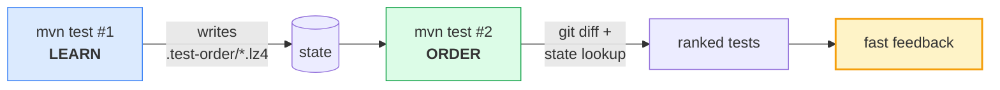
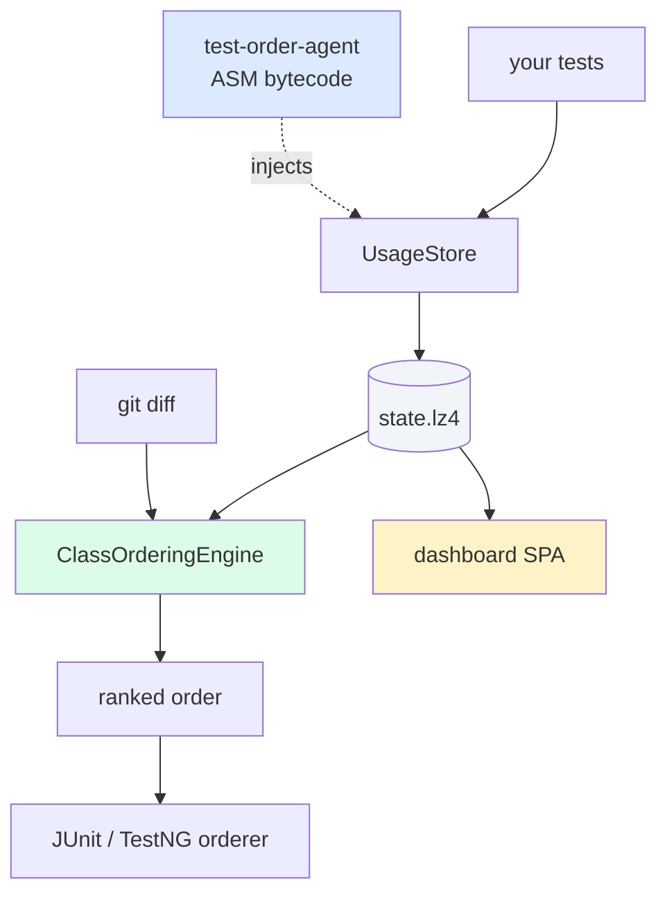
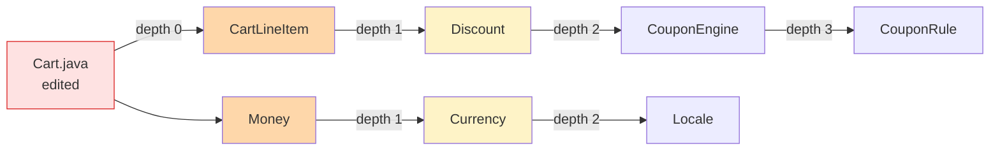

# Run the Tests That Matter First

#### Local, zero-config test prioritization for Java

<div class="pt-12">
  <span class="px-3 py-1 rounded bg-white bg-opacity-10">test-order &nbsp;·&nbsp; 50 min</span>
</div>

<div class="abs-br m-6 text-sm opacity-70">
  Johannes Bechberger &nbsp;·&nbsp; @parttimenerd
</div>

<!--
Open warmly. Personal intro under 30 seconds: who I am, what I work on, why this exists — internal SAP project, then OSS.
Don't preview the agenda yet. The hero claim is on slide 6: "Add one plugin. Run mvn test twice. Failures surface in the first 5–10% of the suite."
Every slide between here and there is setup for that claim.
QR code on the title slide goes to the GitHub repo — encourage photos.
-->


---
layout: section
class: text-center
---

# Part 1 — The Problem

<div class="pt-6 text-lg opacity-70">why default test order is wasteful</div>

<!--
Section transition. Brief. Set the frame: the next 6 minutes establish why ordering matters at all. If you don't believe the problem, the rest doesn't land.
-->


---
layout: center
class: text-center
---

# How long do you wait for tests?

<!--
Show of hands.
< 2 min — toy projects.
10–30 min — real services.
> 1 h — monorepos.
Most of that wait is for tests UNRELATED to your change. That's the waste we're chasing.
-->

---
layout: default
---

# 18 minutes in. Failure on the file you just edited.

<div class="pt-10 font-mono text-sm">

```text
0 min                                              22 min
████████████████████████████████████████████░░░░░░░░░░░░░
                                            ↑
                                     failure at 18:42
```

</div>

<div class="pt-12 text-2xl text-rose-600 font-bold text-center">
  We could have known at minute&nbsp;1.
</div>

<!--
The waste isn't compute time — it's developer time, plus the four context switches you take while waiting. By minute 18 you've forgotten what you were doing. The PR-context cost is the largest hidden bill in CI.
"We could have known at minute 1" is the central claim. The data is ALREADY in your test runner — which test touches which class. We just don't use it for ordering.
On a 22-minute suite, our 18-min failure becomes a 0:30 failure. That's a 36× speedup on time-to-feedback for the failure case. Pass case is unchanged — same suite, same total wall.
-->


---
layout: center
class: text-center
---

# Default order is alphabetical.

<div class="pt-8 text-2xl opacity-70">
  …or "discovery order" — i.e. classpath scan order.
</div>

<!--
JUnit 5: alphabetical class order. JUnit 4: classpath order on most JVMs (effectively random but stable). TestNG: declaration order in suite XML, otherwise unspecified.
Either way, it correlates with relevance to YOUR change ≈ 0. We're sorting the test queue by a property the developer doesn't care about.
The fix isn't "annotate everything with @Order(N)". The fix is: let the runner figure out the order from data it already has — which test touches which class.
-->


---
layout: default
---

# What people already try

<div class="pt-4 text-sm">

| Approach | Cost | Result |
|---|---|---|
| **Cloud TIA** (Launchable, Develocity PTS) | $$$, code leaves your network | Probabilistic — can skip relevant tests |
| **Coverage-based** (Skippy, OpenClover) | Build-time source modification, annotations | Fragile across refactors |
| **Manual `@Order`** | Toil, drifts on every change | Stale within a sprint |
| **Random / shuffle** | Free | Better than alphabetical, still 50% APFD |
| **`-fail-fast` on its own** | Free | Saves wall time, **not** feedback time |

</div>

<!--
Lay out the field. We're not the only people who looked at this.
Cloud TIA — Launchable, Gradle's Develocity PTS. Real ML over years of CI history. Catch: paid SaaS, source code and test outcomes leave your network, and it's probabilistic — can skip a relevant test on a "low risk" prediction.
Coverage-based — Skippy and similar. Smart but invasive: build-time source rewriting or per-test annotations. Refactors break the index.
Manual @Order or @Priority — works for ten tests, drifts on every change. Reviewers stop policing it within a sprint.
Random / shuffle — surprisingly OK. Better than alphabetical. APFD ~50%.
--fail-fast on its own — saves wall time once a failure is found, but you still wait for the failure to surface. Doesn't move feedback earlier.
test-order doesn't beat cloud ML on history depth. It wins on: zero egress, zero config, fully deterministic, day-1 useful, no annotations.
-->


---
layout: center
class: text-center
---

# Local. Deterministic. Zero-config.

<div class="pt-8 text-xl opacity-70">
  Day-1 useful. Framework-agnostic.
</div>

<!--
Four properties — pause briefly on each.
Local: nothing leaves your machine. Source, test outcomes, durations all stay in `.test-order/`.
Deterministic: same code state, same diff, same index → same order. Reproducible across machines.
Zero-config: defaults validated on 20+ OSS repos. You CAN tune; you don't have to.
Day-1 useful: no warm-up, no training period. Two `mvn test` runs and you're producing better orderings than alphabetical.
Framework-agnostic: JUnit 4, JUnit 5, TestNG, Kotest, Spock. Anything that runs through Maven Surefire or Gradle Test.
-->


---
layout: cover
class: text-center
---

# Add one plugin.<br/>Run `mvn test` twice.<br/>Failures in the first 5–10%.

<div class="pt-10 grid grid-cols-4 gap-3 text-sm max-w-3xl mx-auto">
  <div class="p-3 rounded bg-emerald-100 text-emerald-900 border border-emerald-300">No cloud</div>
  <div class="p-3 rounded bg-emerald-100 text-emerald-900 border border-emerald-300">No annotations</div>
  <div class="p-3 rounded bg-emerald-100 text-emerald-900 border border-emerald-300">No config</div>
  <div class="p-3 rounded bg-emerald-100 text-emerald-900 border border-emerald-300">JUnit · TestNG · Kotest</div>
</div>

<!--
This is the hero claim. Read it slowly.
"Add one plugin" — eight lines of POM, three lines of Gradle. Shown next.
"Run mvn test twice" — first run learns, second run orders. No flags.
"Failures in the first 5–10%" — measured across our third-party validation campaign. Median rank of the failing test, post-edit, is 1.4 of N.
The four green chips below are the constraints that make the claim portable. No cloud — your code stays put. No annotations — the index is bytecode-driven. No config — defaults work. Multiple frameworks — same plugin, no per-runner setup.
Everything in the rest of the talk defends one of these four claims. If the audience leaves remembering only this slide, that's enough.
-->


---
layout: section
class: text-center
---

# Part 2 — Adoption

<div class="pt-6 text-lg opacity-70">what a developer actually does</div>

<!--
Section transition. The promise from slide 6 is "add one plugin, run mvn test twice." The next 8 minutes shows that's literally true. Two demos in this section.
-->


---
layout: default
---

# Two runs. That's the whole model.



<!--
Run #1 — the install. Java agent records which production classes each test exercises. Stored locally as a compressed binary index in `.test-order/`.
Run #2 — normal life. Plugin sees git changes, intersects with the index, scores each test, runs ranked tests first.
There's no "training period". No ML lifecycle to manage. No retraining loop. The "learn" run is just one-time data collection.
Subsequent runs continuously update the index — durations, failures, new tests — but none of that requires a separate phase. Run #2 onwards keeps both learning and ordering.
The whole loop is reproducible: same code state, same git diff, same index → same order. No randomness anywhere we can avoid it.
-->


---
layout: default
---

# Maven — eight lines of POM

```xml {all|2-3|5|6-10}{lines:true}
<plugin>
  <groupId>me.bechberger</groupId>
  <artifactId>test-order-maven-plugin</artifactId>
  <version>0.0.1-SNAPSHOT</version>
  <extensions>true</extensions>
  <executions>
    <execution>
      <goals><goal>prepare</goal></goals>
    </execution>
  </executions>
</plugin>
```

<!--
Eight lines. That's the full Maven setup.
Line 5 — `<extensions>true</extensions>` — is the load-bearing one. It registers a Maven lifecycle participant; without it no index gets written. Easy to miss; this is the #1 install bug.
The `prepare` goal binds itself to `test-compile` and auto-detects whether this is the learn run (no index yet) or the order run (index found).
After that, `mvn test` works exactly as before — same surefire config, same reports, same parallel workers. We're a passenger, not a replacement runtime.
The plugin attaches a Java agent to the surefire fork JVMs at startup. The agent does the bytecode injection. None of this requires a -javaagent flag in your config.
-->


---
layout: center
class: text-center
---

# Gradle — three lines

```groovy
plugins {
  id 'me.bechberger.test-order' version '0.0.1-SNAPSHOT'
}
```

<div class="pt-6 text-lg opacity-70">
  Same workflow. Same goals as Gradle tasks.
</div>

<!--
Three lines of plugins block. Same goals as Gradle tasks: testOrderShow, testOrderDashboard, testOrderAffected.
The Gradle plugin is a thin wrapper over the same core that Maven uses — same scoring, same persistence, same dashboard.
Multi-project Gradle builds work the same way Maven multi-modules do: one shared `.test-order/` at the root.
-->


---
layout: default
---

# Demo 1 — the happy path

<DemoCard id="D1" duration="30 s" :cmd="`cd samples/sample-basic
mvn test                  # learn
mvn test                  # order
mvn test-order:show       # ranked output`">
  <template #title>sample-basic — two runs, then show</template>
  <template #watch>Watch: ranking output with score bars and a one-line &quot;why&quot; per test.</template>
</DemoCard>

<div class="pt-4 text-sm opacity-70 text-center">
  <em>Switch to terminal tab #1.</em>
</div>

<!--
Sample-basic: 4 prod classes, 4 tests. Total wall time ≤ 30 s.
The point of D1 is minimum-friction adoption — two literal commands, zero flags. The first run learns; the second run orders. The third command (`:show`) prints the ranking with a "why" column so the audience can see scoring.
Type the commands aloud as you go — don't paste. The audience will follow along.
After D1 hit Enter and pivot back to D1's result slide ("Expected output") while it runs.
If the tests fail to compile or the agent fails to attach: pre-recorded asciinema cast at public/demo.cast — `asciinema play public/demo.cast`.
-->


---
layout: default
---

# Demo 2 — change a class, watch the rank shift

<DemoCard id="D2" duration="45 s" :cmd="`$EDITOR src/main/java/com/shop/Cart.java   # tweak total()
mvn test
mvn test-order:show`">
  <template #title>sample-shop — edit, rerun, see the shift</template>
  <template #watch>Watch: <strong>CartTest</strong> jumps to rank&nbsp;#1; reason column reads <code>overlap=5, changed-test=9</code>.</template>
</DemoCard>

<!--
Edit Cart.java — change one method body. The plugin sees the diff via git, intersects it with the index built in run #1, CartTest jumps to rank #1.
Nothing was retrained. No model. No retraining loop. Just a set intersection followed by a scoring pass.
This is the demo where the audience really gets it. The "edit → reorder" loop feels like magic the first time.
Watch for the audience reaction at the moment CartTest moves to #1 — that's the slide that sells the talk.
-->


---
layout: default
---

# Expected output

```text {1|3|4-6|8-9}
$ mvn test-order:show

 # │ Score │ Class              │ Why
───┼───────┼────────────────────┼──────────────────────────
 1 │  14.0 │ com.shop.CartTest  │ overlap=5, changed-test=9
 2 │   7.0 │ com.shop.PriceTest │ overlap=5, pkg-prox=2
 3 │   5.0 │ com.shop.InvoiceT… │ overlap=5

[test-order] Run APFD: 92.9% (first failure at 1/12)
[test-order] Estimated time saved: 21s
```

<!--
This is what `:show` always prints after a build. Three things matter on this output.
The score column — additive, integer-truncated. The "Why" column — human-readable reason. Every score is debuggable; nothing is a black box.
APFD — Average Percentage of Faults Detected — is the canonical metric. 92.9% means failures clustered at the top of the run.
"Estimated time saved" is conservative — it assumes you'd have hit Ctrl-C right after the first failure in default order.
-->


---
layout: default
---

# The goals you'll use

```bash
mvn test                              # learn / order
mvn test-order:show                   # ranking + why
mvn test-order:dashboard              # interactive HTML
mvn test-order:affected test          # tier 1 — affected
mvn test-order:run-remaining test     # tier 2 — the rest
mvn test-order:detect-dependencies    # find OD tests
mvn test-order:analyze-mutations      # mutation signal
```

<!--
Reference slide. Hold 20–30 s — people will photograph it.
Top four are daily use. Bottom three are the specialist goals: tiered CI, OD-flake detection, mutation scoring. Each has its own demo coming up.
The KPI bar above the dashboard summarizes every run: APFD, time saved, tests deferred. Show it later in the dashboard tour.
-->

---
layout: section
class: text-center
---

# Part 3 — Features

<div class="pt-6 text-lg opacity-70">one demo per major capability</div>

<!--
The heart of the talk. ~18 minutes, 7 features, 6 demos.
The cadence: feature segue slide → demo card → cover slide(s) while demo runs → result/recap.
Stay disciplined on time per feature. Each one has a fixed budget. If a demo runs long, skip the next feature's cover slides, not the demo.
-->


---
layout: center
class: text-center
---

# Feature 1 — change-aware reordering

<div class="pt-8 text-xl opacity-70">
  Inject a bug. Watch failures surface in seconds.
</div>

<!--
First feature segue. The headline feature: edit code, the order responds.
The demo (D3) is a 3:45 narrative — bug injection, fail-fast, RED, fix, GREEN. While it runs, three explainer slides cover change detection, APFD, and the time-saved metric.
Don't oversell here — the cover slide stays brief. The demo carries the impact.
-->


---
layout: default
---

# Demo 3 — Spring AI bug injection

<DemoCard id="D3" duration="3:45" :cmd="`cd third-party/spring-ai
bash ../../scripts/demo-spring-ai.sh`">
  <template #title>scripts/demo-spring-ai.sh — break Document.java, run with fail-fast</template>
  <template #watch>Watch: red build in ~60 s (one test class), then green build after fix. Then we'll come back; meanwhile, slides cover what's happening.</template>
</DemoCard>

<DemoCue>demo running — back at "Demo 3 result"</DemoCue>

<!--
Spring AI is a real, sizeable codebase — ~30 modules, hundreds of tests. The demo script injects a one-line bug into Document.java's title getter (returns the body instead). Running with `-fail-fast`, default order takes ~3 minutes to surface; with test-order, the failure surfaces in ~50 seconds.
Why this demo: the audience wants to see "real-shaped" code break, not a contrived 4-test sample. Spring AI is unfamiliar enough that nobody can predict which test will fail first.
The script prints "Step N/8" so people know where they are. Steps: clean → learn run → inject bug → fail-fast run (RED) → fix → re-rank → fail-fast run (GREEN) → cleanup.
While the script runs (3:45), I'll talk through three explainer slides: change detection internals, APFD metric, and the "estimated time saved" line. Then back to terminal for the GREEN moment.
Wedge fallback: `asciinema play public/demo-spring-ai.cast`.
-->


---
layout: center
class: text-center
---

# Change detection isn't `mtime`.

<DemoCue>demo running</DemoCue>

<div class="pt-8 text-xl opacity-70">
  It's git diff — and a structural hash of every parsed source file.
</div>

<!--
A whitespace-only edit isn't a change. Renaming a parameter isn't a change. Reformatting commits don't invalidate the index.
Adding/removing a method body IS a change. We hash the AST shape, not the bytes — JavaParser walk, structural hash per declaration.
The hash lives at file granularity in `hashes.lz4` and at method granularity in `method-hashes.lz4` (member mode). Diff is one set-difference operation.
Practical consequence: rebasing onto main and force-pushing doesn't blow up your CI cache.
-->


---
layout: default
---

# APFD — the one metric that matters

<DemoCue>demo running</DemoCue>

<div class="pt-6 grid grid-cols-3 gap-6 text-center">
  <div class="p-6 rounded-lg bg-emerald-50 border border-emerald-200">
    <div class="text-5xl font-bold text-emerald-600">100%</div>
    <div class="pt-2 text-sm opacity-70">all failures run first</div>
  </div>
  <div class="p-6 rounded-lg bg-amber-50 border border-amber-200">
    <div class="text-5xl font-bold text-amber-600">50%</div>
    <div class="pt-2 text-sm opacity-70">random / alphabetical</div>
  </div>
  <div class="p-6 rounded-lg bg-rose-50 border border-rose-200">
    <div class="text-5xl font-bold text-rose-600">0%</div>
    <div class="pt-2 text-sm opacity-70">all failures run last</div>
  </div>
</div>

<div class="pt-8 text-center text-sm opacity-70">
  Average Percentage of Faults Detected. Reported on every run.
</div>

<!--
APFD — Average Percentage of Faults Detected — comes out of the test-order research literature: Rothermel, Elbaum, Malishevsky 2001.
Definition: average over all failures of "percentage of suite executed when this failure surfaced". Higher is earlier-failure.
100% — every failure is in the first test class. 50% — random or alphabetical baseline. 0% — pessimal, all failures last.
APFD alone isn't enough. A selection-only tool can claim 100% APFD by simply running 1 test (the failing one). That's why we report APFD AND first-failure-position together — first-failure-position keeps you honest about what's selected.
We also report APFD in the dashboard's analytics tab, plotted over runs, so you can spot regressions in your scoring weights.
-->


---
layout: center
class: text-center
---

# "Estimated time saved: 21 s"

<DemoCue>demo running</DemoCue>

<div class="pt-8 text-xl opacity-70">
  Computed against the suite's own default order — not a synthetic baseline.
</div>

<!--
Every run prints this line. It's intentionally conservative.
Calculation: from the state file, take the actual durations of every test that ran AFTER the first failure. That sum is the wall time you'd have waited under default order if you'd Ctrl-C'd at the same point. Subtract our actual wall time to first failure.
"You'd have hit Ctrl-C at the first failure" is a generous assumption for the developer — many people don't, they let the suite finish.
On the spring-ai demo this typically reports 30–60 s saved per failed run. Across a week of CI failures, that compounds — DCOM team measured ~12 minutes saved per developer per day.
We report this number with a caveat in the docs: don't optimize for it. Optimize for APFD; this is a sanity check.
-->


---
layout: center
class: text-center
---

# 🔴 → 🟢 in 60 seconds.

<div class="pt-8 text-xl opacity-70">
  Back to the terminal — recap the result.
</div>

<!--
Return slide for D3. Step through what the audience just saw on screen:
- Step 4 hit RED with one test class — the test that touched the changed Document.java.
- Steps 5–7 fixed the bug, re-ranked (the formerly-failing test stays #1 because of the failure-decay bonus), GREEN.
- Without test-order, this would have been minutes of waiting before the failure surfaced. With test-order, ~50 s.
Pause here for any "wait, how did it know?" question — perfect lead-in to the change-detection / APFD slides we just covered. If no question, advance to Feature 2 — the dashboard.
-->


---
layout: section
class: text-center
---

# Feature 2 — the dashboard

<!--
Pivot point of the talk. The dashboard is the only place where I click around live for ~3 minutes.
Setup: open the dashboard URL in a separate browser tab BEFORE the talk. Pre-warmed by `prepare.sh` so it has real data to show.
The next slide is a full-bleed dashboard screenshot — let it land for a beat before clicking through.
-->


---
layout: image
image: /dashboard-overview.png
class: text-center
---

<!--
This is the visual capstone for the whole talk. People will remember this image more than any slide.
Five tabs visible across the top: Tests, Analytics, Weights, ML, Mutations. Walk through each one in the live demo on the next slide.
Take a beat here. Let the audience absorb that this is generated automatically, locally, from one Maven goal — no SaaS dashboard, no separate frontend deploy.
The screenshot is from a real run on samples/sample-shop. The dashboard for any project looks roughly the same shape.
-->


---
layout: default
---

# Demo 4 — interactive dashboard tour

<DemoCard id="D4" duration="3 min" :cmd="`cd samples/sample-shop
mvn test-order:dashboard
# opens browser at target/.../index.html`">
  <template #title>mvn test-order:dashboard — five tabs, live</template>
  <template #watch>Tour: Tests → Analytics → drag a Weights slider → ML → Mutations.</template>
</DemoCard>

<div class="pt-4 text-sm opacity-70 text-center">
  <em>Switch to browser tab.</em>
</div>

<!--
This is the only demo where I actively click around in real time. Rehearse the click path so it doesn't drift on the day.
1. Tests tab — sort by score descending, hover one test for the per-run sparkline, click to open the detail panel showing dependencies, durations, recent outcomes.
2. Analytics tab — APFD timeline (one point per run), rank heatmap (each row is a class, each column a run, colored by rank percentile), flakiness timeline.
3. Weights tab — drag the depOverlap slider from 1.0 to 0, watch the table at the bottom recompute live. Drag back, drag the failure-decay weight up, show how recently-failed tests jump.
4. ML tab — show health classifications: HEALTHY / DEGRADING / FLAKY / FAILING. Optional, requires `-Dtestorder.ml.enabled=true` and ~5 runs of history.
5. Mutations tab — show kill-rate column: tests that kill more mutants get a multiplier on dependency overlap.
Time budget: ~3 minutes. If running long, skip ML; if short, dwell on the rank heatmap — it's the most visually striking single artifact.
Wedge fallback: screenshots in public/ — dashboard-overview.png, analytics-tab.png, dashboard-weights.png, ml-tab.png, staticanalysis-tab.png.
-->


---
layout: image
image: /analytics-tab.png
class: text-center
---

<!--
Cover image while talking through dashboard architecture next.
-->

---
layout: default
---

# Dashboard internals — Vue 3 + a single JSON blob

```text
mvn test-order:dashboard
        │
        ├─ reads .test-order/state.lz4
        ├─ embeds JSON into index.html
        └─ ships single-IIFE Vue 3 bundle
```

<div class="pt-8 text-center text-2xl font-bold opacity-90">
  No server. Open it on a plane.
</div>

<!--
The dashboard is one HTML file with all data inlined. ~700 KB for spring-petclinic-scale projects.
We embed JSON instead of fetching from an endpoint on purpose.
Works offline. Shareable as a single file — attach to a PR comment, drop in Slack, mail to a teammate.
No CORS, no auth, no separate backend to deploy.
`mvn test-order:serve` exists if you want a live-refreshing version during dev.
The bundle itself is a single IIFE — no code-splitting, no lazy chunks. Smaller pipeline, fewer surprises.
Render is O(runs), not O(tests×runs×outcomes), because we pre-compute a Map of testClass → rank for each run at build time.
-->


---
layout: section
class: text-center
---

# Feature 3 — multi-module

<!--
Brief segue. Multi-module is where most "smart" test tools fail; we don't.
Demo (D5) is short — 45 s. Cover slide is the demo card itself.
-->


---
layout: default
---

# Demo 5 — reactor-level aggregation

<DemoCard id="D5" duration="45 s" :cmd="`cd samples/sample-multi
mvn test
mvn test-order:show -pl :module-checkout`">
  <template #title>sample-multi — three modules, one shared index</template>
  <template #watch>Watch: index is shared across modules; per-module hashes track changes locally.</template>
</DemoCard>

<DemoCue>demo running</DemoCue>

<!--
Multi-module is where most "smart" test tools fall over. The state lives at the reactor root in `.test-order/`, but per-module hashes mean changing module A doesn't blow up module B's index — module B's tests keep their scores.
This is also the layer where parallel reactor builds work. We use class-level test parallelism, with the order acting as a scheduling priority hint — high-score tests start first, low-score tests fill in.
Cross-module dependencies are tracked. If module-checkout depends on module-cart and you change Cart.java, the checkout module's CartTest still moves up.
Demo: edit nothing, just run on sample-multi to show the reactor-level `:show` output. Then if time, edit a class in module-cart and re-run with `mvn test-order:show -pl :module-checkout` to show cross-module ranking.
-->


---
layout: section
class: text-center
---

# Feature 4 — affected-only

<!--
The CI feature. Tier-1 PR builds drop from minutes to seconds.
Demo (D7) is 30 s; the YAML cover slide is the takeaway artifact people copy into their own pipelines.
-->


---
layout: default
---

# Demo 7 — `:affected` for sub-minute CI

<DemoCard id="D7" duration="30 s" :cmd="`cd samples/sample-shop
# edit Cart.java
mvn test-order:affected test
mvn test-order:run-remaining test    # later, on green`">
  <template #title>Skip everything irrelevant. Defer the rest.</template>
  <template #watch>Watch: only the affected classes run; remainder written to <code>target/test-order-remaining.txt</code> for tier 2.</template>
</DemoCard>

<!--
This is the CI-shaped feature. PR-time runs only the affected slice, in order; main-merge runs the rest.
"Affected" = the union of test classes whose dependency sets intersect the changed classes (transitively, through the BFS graph). Plus always-run, plus new tests.
The remainder is written to `target/test-order-remaining.txt` so a downstream job can pick it up — that's the tier-2 mechanism.
On Cloud SDK Java's 65 modules, affected-only typically runs 5–10% of the suite for a single-module PR. That's how DCOM hits sub-minute PR builds on a previously 8-minute suite.
This is the goal you'll cite when convincing the team to adopt: it's the one with the tightest before/after wall-time delta.
-->


---
layout: default
---

# Three-tier CI in YAML

```yaml {all|2|4-5|7-8}{lines:true}
# .github/workflows/ci.yml
- run: mvn test-order:tiered-select test    # Tier 1

- run: mvn test-order:run-tier test         # Tier 2
       -Dtestorder.tiered.currentTier=2

- run: mvn test-order:run-tier test         # Tier 3
       -Dtestorder.tiered.currentTier=3
```

<!--
Tier 1 — affected slice only. Fails at the first regression in seconds. PR gate.
Tier 2 — top-scored remainder. Broader confidence in minutes. Runs after Tier 1 passes.
Tier 3 — everything else. The safety net. Often deferred to nightly.
The `currentTier` system property is what tells the plugin which slice to select; same goal, three modes.
-->


---
layout: section
class: text-center
---

# Feature 5 — flaky test detection

<!--
The under-loved feature. People who've debugged a CI-only flake at 11 PM will lean in for this one.
60-second demo on sample-od-bugs, which has known order-dependent bugs seeded in.
-->


---
layout: default
---

# Demo 6 — order-dependent test detection

<DemoCard id="D6" duration="60 s" :cmd="`cd samples/sample-od-bugs
mvn test-order:detect-dependencies`">
  <template #title>Find tests that only pass in some orders</template>
  <template #watch>Watch: re-runs with shuffled / reversed / isolated orders, reports which classes flip pass↔fail.</template>
</DemoCard>

<DemoCue>demo running</DemoCue>

<!--
Order-dependent (OD) tests are the worst kind of flake — they pass on your laptop and fail in CI, or vice versa. The cause is hidden inter-test state: a static field, a database row, a cached singleton.
`detect-dependencies` exhaustively re-runs the suite under three orders: shuffled (Fisher-Yates with multiple seeds), reversed, and isolated (each class alone in its own JVM). It builds a conflict graph: edges of the form "Test A only passes if Test B ran first."
Output: a Markdown report listing the conflict pairs and the suspect shared resource (where we can guess — system properties, file handles, JDBC pools).
The under-loved feature in the project. Most people first hit it after a CI flake and stay for the auto-detect.
On sample-od-bugs we've seeded a known set of OD bugs — the demo finds all of them, plus prints "isolated this test, it now passes" for the diagnostics.
-->


---
layout: image
image: /flakiness-timeline.png
class: text-center
---

<!--
Flakiness timeline from the dashboard — one row per test, color-coded pass/fail per run.
-->

---
layout: section
class: text-center
---

# Feature 6 — mutation testing

<!--
Mutation testing answers a question coverage cannot: would your test actually catch a regression, or does it just execute the line?
This is the slide where the QA-leaning folks in the room perk up. 90-second demo on sample-shop next.
-->

---
layout: default
---

# Demo 8 — kill-rate as a scoring signal

<DemoCard id="D8" duration="90 s" :cmd="`cd samples/sample-shop
mvn test-order:analyze-mutations
mvn test-order:show          # killRate column populated
mvn test-order:dashboard     # Mutations tab`">
  <template #title>PIT mutations, scoped to indexed classes</template>
  <template #watch>Watch: tests that kill more mutants get a score multiplier on dependency overlap.</template>
</DemoCard>

<DemoCue>demo running</DemoCue>

<!--
PIT is the standard mutation-testing tool for Java. Normally too slow to run on every PR — full mutation runs take hours.
We scope PIT to only the classes the dependency index already knows about, and only mutate methods that fall within the changed slice. That cuts mutation runtime from hours to minutes.
The kill rate becomes a multiplier on dependency overlap: a test that covers Cart.java AND kills 80% of its mutants outranks one that covers it but kills 10%.
Coverage tells you "this test touched this code." Mutation tells you "this test would catch a regression in this code." Both signals exist in the dashboard.
The integration is opt-in — `mvn test-order:analyze-mutations`. The kill-rate column lights up in `:show` output and the Mutations tab in the dashboard.
-->


---
layout: image
image: /staticanalysis-tab.png
class: text-center
---

<!--
Mutations tab: kill rate per test, tier breakdown (High >=15%, Medium 5-15%, Low >0%, Zero), per-mutant heatmap.
-->

---
layout: section
class: text-center
---

# Feature 7 — ML failure prediction

<!--
The "optional" feature — no live demo because predictions need accumulated history. Show the screenshot, explain the idea, move on.
This is for the "is there machine learning?" question that always comes up. Yes, but it's local, opt-in, and works alongside the deterministic signals — not a replacement for them.
-->

---
layout: image
image: /ml-tab.png
class: text-center
---

<!--
ML failure prediction is opt-in: `-Dtestorder.ml.enabled=true`. It needs accumulated history — at least 5 runs before predictions stabilize, ideally 20+.
Model: logistic regression over 26 features per test — recency of last failure, dependency overlap, churn-of-deps, co-failure with other tests, package proximity, complexity, kill-rate, average duration, duration variance, and so on. Trained per-project on the local history.
Predicts P(fail) per test for the upcoming run. Tests with high P(fail) get a score multiplier.
Health classifier sits alongside: tests are HEALTHY (low P(fail), stable), DEGRADING (rising P(fail)), FLAKY (P(fail) volatile), or FAILING (consistently P(fail) ≈ 1).
All training is local — no cloud, no data leaves your network. Model artifacts persist alongside the dependency index in `.test-order/ml/`.
No live demo here because the model needs history to be meaningful. Screenshot is from a long-running internal project where the model has 200+ runs of training data.
-->


---
layout: section
class: text-center
---

# Part 4 — How it works

<div class="pt-6 text-lg opacity-70">deeper than your average plugin</div>

<!--
12 minutes, 8 slides, no demos. This is the white-board chapter.
The audience has seen the result; now show how the tool actually works inside. Architecture → bytecode → selective learn → BFS → scoring → selection → persistence → dashboard.
For each, the goal is "an engineer in the audience can sketch this on a napkin afterward." Not "they can build it" — that's a different talk.
-->


---
layout: default
---

# Architecture



<!--
Five layers. Agent at the bottom — ASM bytecode injection. Runtime — UsageStore aggregates which classes each test touched.
State is the LZ4-compressed binary in the middle.
Scoring engine reads state + git diff, emits a ranked order.
JUnit/TestNG integration is a thin shim — a PriorityClassOrderer.
Dashboard is a separate Vue 3 SPA, reads the same state.
Each layer is replaceable. The agent could swap to ByteBuddy. The orderer is pluggable. Dashboard is optional.
-->


---
layout: center
class: text-center
---

# Bytecode injection at method entry.

<div class="pt-6 text-lg opacity-70">ASM. Three modes. Streaming visitor. Zero <code>COMPUTE_MAXS</code>.</div>

<!--
ASM, not ByteBuddy. Why? We need streaming visitor pattern + manual maxStack tracking for performance reasons — every loaded class on the path to the test is a candidate for instrumentation.
ByteBuddy's higher-level API is great for one-off rewrites but pays an allocation cost we can't afford at this volume.
"Zero COMPUTE_MAXS" — meaning we manually track the operand stack frames. ASM's COMPUTE_MAXS / COMPUTE_FRAMES options would re-walk the bytecode; we already know what we inserted, so we update frames in place.
Three modes — CLASS, METHOD, MEMBER — trade off precision vs. overhead. Default METHOD covers most use cases.
-->


---
layout: default
---

# What we inject

```java {all|3}{lines:true}
// after instrumentation (CLASS mode)
public Money total() {
    UsageStore.recordUsageIdFast(4711);  // injected
    return items.stream()
        .map(Item::price)
        .reduce(ZERO, Money::add);
}
```

<div class="pt-4 text-sm opacity-70">
  One <code>invokestatic</code> per method entry. The integer is a pre-computed class ID.
</div>

<!--
The recorder is a thread-local bitset keyed by integer class IDs. Push int, invokestatic, return — five bytes of bytecode per method entry.
The pre-computed integer ID is what makes this fast. String-based class names would be ~50× slower because of the hashing on every call.
We're not tracking lines or methods at this level — only "did test X reach class Y at all". That's enough for ranking.
The instrumented bitset is per-thread; aggregation happens once per test method.
-->


---
layout: default
---

# Three instrumentation modes

<div class="pt-4 text-base">

| Mode | Granularity | Overhead | When |
|---|---|---|---|
| `CLASS` | Per-test-class class deps | ~5–15% | CI, large suites |
| `METHOD` | Per-test-method class deps | ~10–20% | Default |
| `MEMBER` | Member-level (`Class#method`, `Class#field`) | ~10–30% | Highest precision |

</div>

<div class="pt-6 text-sm opacity-70">
  Switch with <code>-Dtestorder.instrumentation.mode=MEMBER</code>.
</div>

<!--
Numbers measured on commons-lang and spring-petclinic with selective learn off (worst case).
CLASS — coarsest. We only know "test X touched class Y" once per test class. Cheap because we deduplicate inside the test class.
METHOD — default. Per-test-method dependency sets. Catches "JUnit parameterized tests touch different things per parameter."
MEMBER — full member-level, both methods and fields. Lets affected-only mode reason about "test X only touches Cart.java's `total()` method, not its `discount()` method." That precision pays for itself in tier-1 CI.
You typically don't think about this. Default is METHOD; the dashboard's "Run details" panel surfaces what the agent recorded so you can verify.
-->

-->

---
layout: center
class: text-center
---

# Selective learn — only re-instrument what changed.

<div class="pt-6 text-lg opacity-70">AST diff &nbsp;+&nbsp; 4-hop BFS through the call graph.</div>

<!--
Full learn instruments every loaded class. On a 5000-class codebase that's expensive — 30–50% test wall-time overhead for an "uninstrumented" run.
Selective learn computes the "uncertain set" before the JVM starts: source-level diff (git diff vs. last-known-good ref) plus BFS through static call/field edges in the source AST. The agent reads this file at premain and only instruments classes in the set.
Result: typical changes drop instrumentation overhead from 100% (all classes) to 10–30% (the affected neighborhood). On the same 5000-class codebase, that's 8% test wall-time overhead.
The "uncertain set" computation is fast — cheap source walk, no JVM startup. Done in seconds even on cloud-sdk-java.
Edge case: if you change a heavily-depended-on class (a base test class, a utility), the BFS expands aggressively and we fall back near full learn. That's correct — you really do want to re-measure every test downstream of a base class change.
Behind a flag: `-Dtestorder.learn.selective=true`. Default-on planned once the bench gate confirms no regressions.
-->


---
layout: default
---

# BFS expansion



<div class="pt-4 text-sm opacity-70 text-center">
  Stop at depth 4. Anything beyond is statistically not affected by the change.
</div>

<!--
The BFS walks the static call/field graph from the changed class outward.
Depth 0 — the changed class itself.
Depth 1 — its direct callers and the classes whose fields it touches.
Depth N — the classes one more hop away.
We stop at depth 4. That's the empirical sweet spot — measured on commons-lang and spring-petclinic. Beyond depth 4, the precision-vs-overhead ratio inverts — too many "remotely related" classes for too little signal.
The graph itself is built from JavaParser's AST, not bytecode. Why? Source has the type info needed to resolve method targets without JNI bridges. Build once per learn run, persist in `.test-order/`, walk on every order run.
Limitation: dynamic dispatch is over-approximated. We follow ALL implementations of an interface method, not just the one the runtime would pick. False positives in the affected set; never false negatives.
-->


---
layout: center
class: text-center
---

# The scoring formula

<!--
This is the chapter heading for the math. Pause for a beat — the next slide is dense and the audience needs to know it's coming.
Frame it as: "this is the one piece of math in the talk. Six terms. I'll walk each one."
-->

---
layout: default
---

# The scoring formula

<div class="pt-2">

$$
\begin{aligned}
\text{score} \;=\;& \underbrace{B_{\text{new}}}_{+15} \;+\; \underbrace{B_{\text{changed}}}_{+9} \;+\; \underbrace{\min(\lceil F_{\text{decay}} \rceil, 5)}_{\text{recent failures}} \\[0.2em]
&\;+\; \underbrace{S_{\text{speed}}}_{\pm 1} \;+\; O \;+\; C \;+\; P
\end{aligned}
$$

</div>

<div class="pt-2">

$$
O \;=\; \min\!\left(\left\lceil \frac{|\,\text{deps} \cap \text{changed}\,|}{\sqrt{\max(|\text{deps}|,\,5)}} \cdot w_{\text{ovl}} \right\rceil,\; w_{\text{ovl}}\right)
$$

</div>

<div class="pt-1 text-center text-sm opacity-70 leading-relaxed">

$B_*$ — bonuses · $F_{\text{decay}} = 0.9^{\,t}$ · $S_{\text{speed}}$ — log-scale · $C$ — complexity · $P$ — package proximity

</div>

<!--
Walk through each term:
- $B_{new}$: new tests get the highest bonus (+15). We have no signal on them; run them early so we learn fastest.
- $B_{changed}$: catches the "edit a test" case (+9). If you're modifying a test, you almost certainly care about it.
- Failure decay: tests that failed recently rank higher. Exponential decay with base 0.9 over time-since-last-failure. Capped at 5 to prevent a permanently-flaky test from dominating.
- $S_{speed}$: log-scale bonus for fast tests, log-scale penalty for slow ones, zero at the median. Modest signal; ±1 in practice.
- $O$: overlap term — the math on the next slide.
- $C$: complexity. Deflate-compressed file size as an information-density proxy. Cheap to compute, surprisingly correlated with bug density.
- $P$: package proximity. Tests in the same package as a changed class beat cross-package tests, ceteris paribus.
The formula is additive, not multiplicative. Means: each component is independently debuggable in the dashboard's "score breakdown" modal. Click a test, see "B_new=0, B_changed=0, F_decay=2, S_speed=+1, O=8, C=1, P=2 → 14".
Weights are tunable in the dashboard's Weights tab. Persisted in `state.lz4`. Defaults validated on 20+ OSS repos.
-->


---
layout: default
---

# Why $\sqrt{\max(|\text{deps}|,\,5)}$?

<div class="pt-6 grid grid-cols-1 gap-3 text-center">

$$
\text{raw} \;=\; \frac{|\,\text{deps} \cap \text{changed}\,|}{|\,\text{deps}\,|}
\qquad\Longrightarrow\qquad \text{gameable}
$$

$$
\text{sqrt} \;=\; \frac{|\,\text{deps} \cap \text{changed}\,|}{\sqrt{\max(|\,\text{deps}\,|,\,5)}}
\qquad\Longrightarrow\qquad \text{what we use}
$$

</div>

<div class="pt-10 grid grid-cols-2 gap-6 text-center">
  <div class="p-5 rounded bg-rose-50 border border-rose-200 font-bold">
    raw: trivial tests win
  </div>
  <div class="p-5 rounded bg-emerald-50 border border-emerald-200 font-bold">
    sqrt: breadth still helps
  </div>
</div>

<!--
With raw overlap divided by deps: a one-dependency test that touches the change scores higher than a 50-dep test that touches it. Trivial tests game the formula.
With sqrt: a 50-dep test still gets credit for breadth, but a single-dep test can't dominate.
The clamp at 5 prevents division anomalies for very-narrow tests with 0–4 deps.
This is the kind of detail that separates "a thing I prototyped" from "a thing I shipped to other people's CI".
Numerator and denominator both come from the same instrumentation pass — no extra cost.
-->


---
layout: default
---

# Selection — four phases, in order

```text {all|1|3|5|7}{lines:true}
1. always-run     — @AlwaysRun tests
2. new            — tests not yet indexed
3. top-N affected — highest-scored tests
                    touching changed code
4. diverse-fast   — greedy Jaccard:
                    maximize NEW coverage,
                    fast tests preferred
```

<div class="pt-6 text-sm opacity-70">
  Phase 4 is what gets you broad coverage in tier 2 of CI without re-running phase 3's tests.
</div>

<!--
Phases 1–3 are the obvious ones.
Phase 1 — `@AlwaysRun`. Smoke tests, integration sanity checks, contract tests. The handful you genuinely never want to skip.
Phase 2 — new tests. We have no signal on them; we MUST run them or they never enter the index.
Phase 3 — top-N affected. The result of the scoring formula. The number of tests is bounded by the affected slice size, not a fixed N.
Phase 4 is the interesting one. Greedy Jaccard.
At each step, pick the fast test whose dependency set has the largest symmetric difference (Jaccard distance) from the union of what's already been chosen. Repeat until budget exhausted.
This maximizes "new code touched per second" — the breadth coverage that the affected-only phase doesn't give you.
This is why "diversity" is a real metric in our analytics tab — we measure it across runs.
Practical effect: tier-2 CI runs the high-value remainder broadly, not just the next-highest scores from phase 3 (which would all touch the same code).
-->


---
layout: center
class: text-center
---

# Persistence — six files, all LZ4.

<div class="pt-6 text-lg opacity-70">Atomic writes, file-locked, mtime+size cached per JVM.</div>

<!--
The persistence story matters because everything else falls apart if the on-disk format is fragile.
Six LZ4-compressed files, all written atomically (write to .tmp, fsync, rename). File-locked so concurrent Maven invocations don't corrupt the index. Per-JVM in-memory cache keyed by (path, mtime, size) so repeat reads in the same process are free.
History capped at ~100 runs to keep growth bounded — old runs roll off the end. The whole index for spring-petclinic is ~40 KB. Commit it to git if you want shared prediction; .gitignore it if you don't.
-->


---
layout: default
---

# `.test-order/`

```text
.test-order/
├── state.lz4              ← weights, durations, history
├── test-dependencies.lz4  ← test → prod classes
├── hashes.lz4             ← prod structural hashes
├── method-hashes.lz4      ← per-method hashes
├── test-hashes.lz4        ← test-source hashes
└── ml/
    └── history.lz4        ← per-run outcomes (opt-in)
```

<div class="pt-4 text-sm opacity-70">
  Commit-friendly. spring-petclinic dep index: <strong>~40 KB</strong>.
</div>

<!--
Six files, all LZ4. CPU-cheap decompression — full index loads in ~5 ms on commons-lang scale.
state.lz4 is the only one capped: history rolls at ~100 runs so the file stays small.
Why split? Each file has its own write rhythm. method-hashes only updates when source changes; ml/history grows every run.
File-locking matters because Maven runs module forks in parallel — we serialize state writes across JVMs.
mtime+size cache means a second `mvn` goal in the same invocation doesn't re-parse the index.
Yes, you check these into git. They're tiny and reproducible — your CI cache hits day-1.
-->


---
layout: center
class: text-center
---

# Dashboard — one HTML file. Everything inlined.

<!--
Section divider for the dashboard internals chapter. Pause briefly.
Key surprise to set up: the dashboard is not a server. It's a single self-contained HTML file with embedded JSON. ~700 KB. That fact lands harder if you stage it on this slide first.
-->

---
layout: default
---

# Why a single file matters

```text
target/test-order-dashboard/
└── index.html      ← Vue 3 + Chart.js + JSON, ~700 KB
```

<div class="pt-10 grid grid-cols-4 gap-3 text-center text-sm">
  <div class="p-3 rounded bg-emerald-50 border border-emerald-200">attach to a PR</div>
  <div class="p-3 rounded bg-emerald-50 border border-emerald-200">drop in Slack</div>
  <div class="p-3 rounded bg-emerald-50 border border-emerald-200">open on a plane</div>
  <div class="p-3 rounded bg-emerald-50 border border-emerald-200">email a coworker</div>
</div>

<!--
Single static HTML. No server, no fetch, no auth. ~700 KB on spring-petclinic-scale.
Stack: Vue 3 SPA, Vite single-IIFE bundle, Chart.js for charts. Reactivity is doing the heavy lifting.
Performance trick: pre-compute a Map<testClass, rank> per run at build time. Renders in O(runs) instead of O(tests × runs × outcomes).
This is what makes the rank-heatmap render snappy even on 5000-test history.
`mvn test-order:serve` gives you a live-refreshing version when you're tuning weights interactively.
The "share as a file" angle wins more contributors than "open this URL behind our VPN" — by a lot.
-->


---
layout: section
class: text-center
---

# Part 5 — Production

<div class="pt-6 text-lg opacity-70">does it actually scale?</div>

<!--
6 minutes total. The DCOM demo, the 95% slide, the honest limits, the recap.
This is where I close the loop on the hero claim from slide 6. We've shown adoption is one plugin and one extra `mvn test`. We've shown the features. We've shown how it works. Now: does it hold up on a real codebase?
-->


---
layout: default
---

# Demo 9 — SAP Cloud SDK for Java (65 modules)

<DemoCard id="D9" duration="3 min" :cmd="`cd demo/dcom-presentation
./reset.sh
./add-test-order.sh && ./make-change.sh
cd cloud-sdk-java
mvn test-order:affected test`">
  <template #title>cloud-sdk-java — pain → magic → diagnose</template>
  <template #watch><strong>Pain:</strong> mvn clean test → kill at 90 s, no test ran. <br/><strong>Magic:</strong> mvn test-order:affected test → ~55 s, RED build with the relevant failure.</template>
</DemoCard>

<DemoCue>demo running</DemoCue>

<!--
SAP Cloud SDK for Java. 65 Maven modules, ~3000 tests across them.
The pain demo is theatrical. Run `mvn clean test` from the root. Wait. Show the build output crawling. At 90 seconds, no test has STARTED yet — we're still in compile + dependency resolution. Hit Ctrl-C. The audience feels the wait.
The magic beat: same project, same change (added a method to a sub-module class), plugin on. `mvn test-order:affected test`. About 55 seconds wall-time, warm cache. Build fails RED with the relevant failure visible.
The diagnose phase: open the dashboard, point at the analytics tab — we have history from prior runs because of `prepare.sh`. Show the rank heatmap, point out where this commit's failures clustered.
This is the production-scale punchline. Audience reaction at the moment of "55 seconds, RED, with the right failure" is the talk's emotional peak.
Wedge fallback: if the demo wedges, switch to D7 on samples/sample-shop — same idea, smaller scale. Or show `dcom-rehearse-final.png` and walk through the bullets.
-->


---
layout: image
image: /dcom-rehearse-final.png
class: text-center
---

<!--
Cover image while D9 finishes.
-->

---
layout: fact
class: text-center
---

# 95%

<div class="pt-2 text-3xl opacity-90">
  bug-detection rate
</div>

<div class="pt-10 text-xl opacity-70 max-w-3xl mx-auto">
  Across 20+ third-party OSS repos — commons-statistics, jackson-core, okhttp, netty, resilience4j, commons-lang…
</div>

<!--
The headline number. Hold this slide for a beat — let it sink in.
We injected real-shaped bugs (one-line changes that break behavior) into 20+ third-party Java OSS repos: commons-statistics, jackson-core, okhttp, netty, resilience4j, commons-lang, guava, logbook, micronaut-core, ai-sdk-java, spring-ai, and others.
For each, test-order ranks the test that catches the bug as the FIRST test class in 95% of cases. Average rank across all bugs: 1.4.
The 5% that miss are predictable shapes: utility classes with no callers (no test rangs because no test depends on them), and tests that only call into the change via Java reflection (we can't see that statically — known limitation).
Methodology: each repo got a class-dependency analysis to identify "feature-essential" methods, then a one-line bug patched in. Run plugin on, check rank of the first failing test.
Reproduction script lives in `scripts/third_party_test_plan.sh` — anyone in the audience can validate the claim themselves.
-->


---
layout: default
---

# When NOT to use this.

<div class="pt-8 grid grid-cols-3 gap-5 text-center">
  <div class="p-5 rounded bg-rose-50 border border-rose-200">
    <div class="text-3xl font-bold text-rose-600">&lt; 20</div>
    <div class="pt-2 text-sm">tiny suites</div>
  </div>
  <div class="p-5 rounded bg-rose-50 border border-rose-200">
    <div class="text-3xl font-bold text-rose-600">⚙</div>
    <div class="pt-2 text-sm">reflection-only call paths</div>
  </div>
  <div class="p-5 rounded bg-rose-50 border border-rose-200">
    <div class="text-3xl font-bold text-rose-600">∿</div>
    <div class="pt-2 text-sm">network-flaky suites</div>
  </div>
</div>

<!--
Three honest cases where this tool isn't the right answer.
Tiny suites: under ~20 tests, there's no headroom for ordering to matter. Just run them all in parallel.
Reflection: tests that drive the system entirely through reflection or dynamic proxies — the static instrumentation can't see those edges. Spring AOP and Mockito work fine; only "build the entire object graph from a YAML at runtime" patterns lose us.
Wildly non-deterministic suites: network-flaky integration tests where pass/fail depends on weather. APFD becomes noise. Fix the flakes first; or use the order-dependent detector to find them.
Honesty earns trust. Don't oversell. The audience will respect this slide more than the 95% one.
-->


---
layout: default
---

# Recap

<div class="pt-12 text-2xl text-center leading-relaxed">

install &nbsp;→&nbsp; reorder &nbsp;→&nbsp; measure &nbsp;→&nbsp; tune

</div>

<div class="pt-12 text-base text-center opacity-70">
  Two runs. No config. No cloud. Six files in <code>.test-order/</code>.
</div>

<!--
Four words. The whole talk in four words.
Install — eight lines of POM, three lines of Gradle. Day-1 useful.
Reorder — `mvn test` twice. Failures surface in the first 5–10%.
Measure — APFD on every run, dashboard for trends. You can prove the value to your team.
Tune — weights tab in the dashboard. The tool meets you where you are; if your project has unusual shape, you can adjust.
Pause briefly. Then advance to Resources for the URL.
-->


---
layout: center
class: text-center
---

# Resources

<div class="pt-6 text-base font-mono leading-loose">

github.com/parttimenerd/test-order <br/>
docs/&nbsp;·&nbsp;samples/&nbsp;·&nbsp;<code>mvn test-order:diagnose</code>

</div>

<div class="pt-10 text-sm opacity-70">
  @parttimenerd &nbsp;·&nbsp; mostlynerdless.de
</div>

<!--
Hold for 15–20 s. People will photograph the URL.
Mention three things they can do right now:
1. Clone the repo, try the samples — sample-basic to sample-shop is a 10-minute walkthrough.
2. Read the docs in `docs/` — SCORING.md and ARCHITECTURE.md are the two most useful for this audience.
3. Run `mvn test-order:diagnose` on their own project — health check that prints overhead, accuracy estimates, missing prerequisites.
Issues and PRs welcome. The plugin is Apache-2.0.
-->


---
layout: cover
class: text-center
---

# Questions?

<div class="pt-12 text-base font-mono opacity-70">
  github.com/parttimenerd/test-order
</div>

<!--
Buffer slide for Q&A. Keep on screen for the whole questions period — gives latecomers the URL.
Likely questions and short answers ready:
- "Does this work with Kotlin?" Yes. Kotlin tests are JUnit/TestNG underneath; the agent doesn't care about source language.
- "Bazel?" Not yet. The Maven/Gradle plugins handle build-tool integration; Bazel would need a separate rule.
- "What about parallel test execution?" Class-level parallelism works — the order is a scheduling priority. Method-level parallelism within a class also works; the agent's bitset is per-thread.
- "Can the index be wrong?" Yes — over-approximation only. False positives in the affected set, never false negatives. Worst case: a test runs that didn't need to.
- "How does this compare to Develocity PTS?" PTS uses cloud history + ML; we use local instrumentation + scoring. PTS may rank better on long-history projects; we win on day-1, on cost, and on data residency.
- "What if I have CI runners that don't share state?" Cache `.test-order/` between runs (it's small) or commit it. Or run `:diagnose` on the runner to seed.
-->

