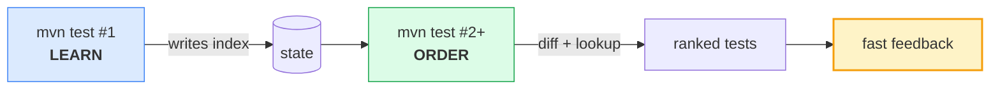
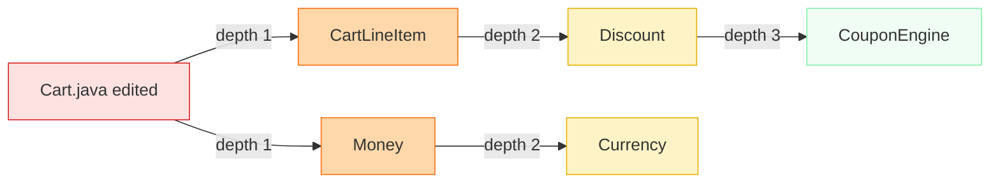

<style>
.big-statement p {
  font-size: 3rem !important;
  font-weight: 700 !important;
  line-height: 1.3 !important;
  text-align: center !important;
  width: 100% !important;
}

.quote-slide {
  display: flex;
  flex-direction: column;
  justify-content: center;
  align-items: center;
  text-align: center;
  padding: 6rem 4rem;
  position: relative;
}
.quote-slide::before {
  content: '\201C';
  position: absolute;
  left: 40px;
  top: 40%;
  transform: translateY(-50%);
  font-size: 15rem;
  font-weight: 900;
  color: rgba(148, 113, 217, 0.18);
  line-height: 1;
  z-index: 0;
}
.quote-text {
  font-size: 1.85rem;
  line-height: 1.7;
  font-style: italic;
  max-width: 820px;
  font-weight: 500;
  position: relative;
  z-index: 1;
}
.quote-attr {
  font-size: 1.05rem;
  opacity: 0.7;
  margin-top: 1.5rem;
  font-weight: 500;
}

.slidev-slide pre,
.slidev-slide .shiki {
  font-size: 1.05rem;
  line-height: 1.6;
  border-radius: 10px;
  padding: 18px 22px;
}
</style>

# Stop Wasting Hours on Tests That Never Fail

<div class="pt-8 text-xl opacity-60">
  Local, zero-config test prioritization for Java
</div>

<div class="abs-br m-6 text-sm opacity-50">
  Johannes Bechberger · @parttimenerd
</div>

<!--
Don't introduce yourself. Don't preview the agenda.
Start with the question on the next slide.
-->


---
layout: center
class: bg-zinc-900 text-white
---

<div class="big-statement">

Who's waited 20 minutes for CI<br/>to tell you the test that failed<br/>was the first thing you changed?

</div>

<!--
Pause. Let hands go up. Most of the room.
"That's the problem. You already knew. The runner just didn't."
Don't move on until you see hands.
-->


---
layout: default
---

<div class="font-mono text-sm pt-6">

```text
0 min                                              22 min
████████████████████████████████████████████░░░░░░░░░░░░░
                                            ↑
                                     failure at 18:42
```

</div>

<div class="pt-14 text-3xl text-rose-500 font-bold text-center">
  You changed that file 22 minutes ago.
</div>

<v-click>

<div class="pt-6 text-xl text-center opacity-90">
  The information to put that test first was already there.
</div>

</v-click>

<!--
Data already existed in the JVM bytecode: which test exercises which class.
We just never used it.
36× faster time-to-feedback for this exact case.
Pass case: unchanged code paths still run, same total wall time, zero overhead.
-->


---
layout: default
---

# Hi. I'm Johannes.

<div class="pt-8 text-xl leading-relaxed">
  OpenJDK developer at SAP &amp; SapMachine team.<br/>
  I got annoyed enough to build something.
</div>

<div class="pt-8 text-base opacity-50">
  @parttimenerd · mostlynerdless.de
</div>

<!--
20 seconds. Who I am, why I care.
Built test-order as a side project after too many lunch breaks waiting for CI.
-->


---
layout: center
class: bg-zinc-900 text-white
---

<div class="big-statement">

Default test order is alphabetical.

</div>

<v-click>

<div class="text-xl text-center mt-8 opacity-90">
  Maven Surefire: alphabetical class name.<br/>
  JUnit 5: <em>"deterministic but intentionally nonobvious."</em>
</div>

</v-click>

<!--
Maven Surefire: filesystem scan, alphabetical class name by default.
JUnit 5 docs say exactly: "By default, test classes and methods will be ordered using an
algorithm that is deterministic but intentionally nonobvious."
Intentionally nonobvious = no one promises it helps you. It just doesn't hurt reproducibility.
Correlation with "relevance to your change" = 0. That's the real problem.
-->


---
layout: center
class: bg-zinc-900 text-white
---

<div class="big-statement">

ZipUtilsTest runs<br/>before AuthServiceTest.

</div>

<v-click>

<div class="text-2xl text-center mt-8 opacity-90">
  You changed auth. You'll find out last.
</div>

</v-click>

<!--
Concrete. Makes the problem felt.
Transition: "So what do people do about it?"
-->


---
layout: default
---

# What people already try

<div class="pt-4">

| Approach | Gap |
|---|---|
| **Cloud TIA** (Launchable, Develocity PTS) | Paid, code leaves your network, probabilistic |
| **Coverage-based** (Skippy, OpenClover) | Source modification, fragile across refactors |
| **Manual `@Order`** | Stale within a sprint |
| **Random / shuffle** | Still 50% APFD — a guess |
| **Stop-on-first-failure** | Saves wall time, doesn't surface failures earlier |

</div>

<!--
Don't dismiss these. Each is real.
Our position: local, deterministic, zero config, day-1 useful.
Cloud TIA wins on long-history projects — with a paid subscription and data egress.
Stop-on-first-failure (Maven --fail-fast / Surefire failFast): terminates the run early once
something breaks, cutting wall time. Doesn't change which test runs first — you still wait
through alphabetical order before the first signal. test-order complements it: run it with
stop-on-first-failure and the first failure is the *right* failure, not a random one.
-->


---
layout: section
---

# The Idea

<div class="pt-4 opacity-60">25 years of research, one weekend of plumbing</div>

<!--
Five slides. Foundation, then the claim.
-->


---
layout: center
class: bg-zinc-900 text-white
---

<div class="big-statement">

The signal is real.<br/>25 years of papers say so.

</div>

<!--
Rothermel et al. 1999: first formal TCP results.
Yoo & Harman 2012: surveyed 20+ years of results. APFD is the standard metric.
Not "look at all this research" — the point: we're not guessing. The heuristics are validated.
-->


---
layout: default
---

# The research trail

<div class="pt-4">

**Rothermel et al. (1999)** — the founding TCP paper. Defined the problem, the metrics, the safety criterion. Every subsequent paper cites it.

</div>

<v-click>

<div class="pt-4">

**Yoo & Harman (2012)** — canonical TCP/RTS survey. APFD is the standard metric. Two decades of evidence: failure history + code churn = strong ordering signal.

</div>

</v-click>

<v-click>

<div class="pt-4">

**Memon et al. / Google (2017)** — 5.5M test targets, 500K+ code changes. 91% of tests never fail. The failing ones cluster near recently changed code.

</div>

</v-click>

<v-click>

<div class="pt-4">

**Luo et al. (2014)** — 51 Apache projects, 201 flaky-test commits. Test order dependency: 12% of root causes. 74% of those fixed by cleaning shared state.

</div>

</v-click>

<v-click>

<div class="pt-8 text-2xl font-bold text-center">
  We built the zero-config version.
</div>

</v-click>

<!--
Four papers, one pivot. Don't rush.
Rothermel 1999: "where the field started" — audience who knows TCP will nod.
Yoo/Harman: the signal is real and measurable.
Google: 91% — the most concrete number. This is the evidence.
Luo 2014: grounds quarantine + OD detection features.
"We built the zero-config version" — no ML pipeline, no cloud, no training data required.
-->


---
layout: center
class: bg-zinc-900 text-white
---

<div class="big-statement">

91% of tests at Google<br/>never failed. Not once.

</div>

<v-click>

<div class="text-xl text-center mt-8 opacity-90">
  Of 5.5 million test targets: 99 passing executions<br/>for every 1 that finds a bug.
</div>

</v-click>

<!--
Memon et al., ICSE-SEIP 2017. Google's TAP system. 500K+ code changes analyzed.
"91.3% passed at least once and never failed even once."
PASSED:FAILED ratio per code change = 99:1.
The failing 1% is what developers are waiting for. Random ordering buries it.
This isn't a Google problem — it's every project above a certain size.
-->


---
layout: center
class: quote-slide bg-zinc-900 text-white
---

<div class="quote-text">
"Very few of our tests ever fail, but those that do are generally 'closer' to the code they test."
</div>
<div class="quote-attr">Memon et al. — Taming Google-Scale Continuous Testing, ICSE-SEIP 2017</div>

<!--
The empirical foundation for dep-overlap scoring.
"Closer" = shorter path in the dependency graph. We operationalize it as set intersection:
deps(test) ∩ changed_classes. The larger the overlap, the higher the score.
-->


---
layout: center
class: bg-zinc-900 text-white
---

<div class="big-statement">

If a test hasn't touched<br/>the changed code,<br/>it <em>cannot</em> fail on this change.

</div>

<!--
Say it slowly. This is the logical foundation.
"Cannot" — not "probably won't." Cannot.
Evidence: Google measured it at 5.5M scale. Now we can act on it.
-->


---
layout: center
class: bg-zinc-900 text-white
---

<div class="big-statement">

Record the map once.<br/>Use it forever.

</div>

<v-click>

<div class="text-xl text-center mt-8 opacity-90">
  One instrumented learn run.<br/>Zero overhead on every run after.
</div>

</v-click>

<!--
"Record the map" = one learn run with a Java agent.
"Use it forever" = every subsequent run is uninstrumented.
-->


---
layout: default
---

# Two runs. That's the whole model.



<!--
Run #1: agent records which production classes each test exercises. Binary index, local.
Run #2+: plugin sees git diff, intersects with the index, scores each test, ranked order.
No training period. No retraining. One-time data collection.
Same code state, same diff, same index → same order. Fully reproducible.
-->


---
layout: fact
---

# 50% → 85–90%

<div class="pt-2 text-2xl opacity-80">
  APFD — failures surface in the first 20% of wall time.
</div>

<div class="pt-8 text-base opacity-50">
  Average Percentage of Faults Detected · 100% = all failures first · 50% = random / alphabetical<br/>
  Measured: synthetic one-line bugs · 20+ OSS repos · rank of first failing test
</div>

<!--
The hero claim. Say it once, clearly. Don't move on for 3 seconds.
50% APFD = random or alphabetical baseline (Yoo & Harman 2012 establishes this as the standard baseline).
85–90% = test-order, measured across 20+ open-source repos.
Methodology: inject a feature-essential one-line bug, run test-order, record rank of first failing test.
This is reproducible — scripts/third_party_test_plan.sh runs the full campaign.
-->


---
layout: section
---

# Adoption

<div class="pt-4 opacity-60">what a developer actually does</div>

<!--
18 minutes. Four live demos.
-->


---
layout: center
class: bg-zinc-900 text-white
---

<div class="big-statement">

Maven: ten lines of POM.

</div>

<!--
Next slide shows the code.
-->


---
layout: default
---

```xml {all|2-3|5|6-10}{lines:true}
<plugin>
  <groupId>me.bechberger</groupId>
  <artifactId>test-order-maven-plugin</artifactId>
  <version>0.1.0</version>
  <extensions>true</extensions>
  <executions>
    <execution>
      <goals><goal>prepare</goal></goals>
    </execution>
  </executions>
</plugin>
```

<div class="pt-6 text-base opacity-60">
  Line 5 is the load-bearing one. Without <code>extensions</code>, no index gets written.
</div>

<!--
Ten lines. Full Maven setup.
extensions=true registers a Maven lifecycle participant. This is the #1 install mistake.
`prepare` auto-detects: no index → learn run. Index found → order run.
`mvn test` works exactly as before — same surefire config, same reports.
-->


---
layout: default
---

# Demo 1 — Maven from scratch

<DemoCard id="D1" duration="5 min" :cmd="`cd samples/sample-shop
mvn test                  # learn run
mvn test                  # order run
mvn test-order:show       # scores + why`">
  <template #title>Zero to ordered in two commands</template>
  <template #watch>Watch: <code>.test-order/</code> appears after run #1. Run #2 shows tests in scored order with a why column.</template>
</DemoCard>

<div class="pt-4 text-sm opacity-50 text-center"><em>Switch to terminal tab #1.</em></div>

<!--
Type commands aloud — don't paste.
After run #1: "Six files in .test-order/. That's everything it needs."
After run #2: "Same command. No flags. The order changed."
After :show: point at score and why columns. "Every score is debuggable."
Fallback: `asciinema play public/demo-d1.cast`
-->


---
layout: default
---

# What `:show` prints

```ansi {1|3|4-6|8-9}
$ mvn test-order:show

 # │ Score │ Class              │ Why
───┼───────┼────────────────────┼──────────────────────────
 1 │  14.0 │ com.shop.CartTest  │ overlap=5, changed-test=9
 2 │   7.0 │ com.shop.PriceTest │ overlap=5, pkg-prox=2
 3 │   5.0 │ com.shop.InvoiceT… │ overlap=5

[test-order] Run APFD: 92.9% (first failure at 1/12)
[test-order] Estimated time saved: 21s
```

<!--
Cover slide while D1 runs. Three things:
1. Score column — additive integers. Debuggable in the dashboard.
2. Why column — human-readable per-signal breakdown.
3. APFD line — printed on every single run. This is your proof.
"Estimated time saved" assumes you'd Ctrl-C at first failure. Conservative.
-->


---
layout: default
---

# Demo 2 — edit → rank shift

<DemoCard id="D2" duration="2 min" :cmd="`# One line changed in Cart.java
$EDITOR src/main/java/com/shop/Cart.java
mvn test
mvn test-order:show`">
  <template #title>Change one method. Watch CartTest jump to #1.</template>
  <template #watch>Why column: <code>overlap=5, changed-test=9</code>. Nothing retrained. Just a set intersection.</template>
</DemoCard>

<!--
The demo where it clicks.
Set intersection + scoring pass. No model. No retraining.
Watch the room when CartTest moves to #1.
-->


---
layout: center
class: bg-zinc-900 text-white
---

<div class="big-statement">

Gradle: three lines.

</div>

<!--
Next slide shows the code. Same arc, different build tool.
-->


---
layout: default
---

```groovy
plugins {
  id 'me.bechberger.test-order' version '0.1.0'
}
```

<div class="pt-8 text-2xl font-semibold">
  Same core, same scoring, same index, same dashboard.
</div>

<div class="pt-4 text-lg opacity-60">
  Multi-project builds share one <code>.test-order/</code> at the root.
</div>

<!--
Thin wrapper. Identical behaviour.
-->


---
layout: default
---

# Demo 3 — Gradle

<DemoCard id="D3" duration="2 min" :cmd="`cd samples/sample-gradle
./gradlew test            # learn + order
./gradlew testOrderShow   # ranking`">
  <template #title>Three lines. Same result.</template>
  <template #watch>Point out: camelCase tasks, Gradle daemon stays warm, <code>.test-order/</code> at project root. Same APFD line.</template>
</DemoCard>

<!--
DON'T repeat the Maven demo. Say: "Same data model, same scoring, same index. I'll skip the narration."
Show two differences only: task naming (testOrderShow vs test-order:show) and the Gradle daemon warmup.
If you're running long: skip this demo entirely, say "Gradle is three lines — same outcome" and move on.
Fallback: `asciinema play public/demo-d3.cast`
-->


---
layout: default
---

# Instrumentation modes

<div class="pt-4">

| Mode | What it records |
|:---|:---|
| `CLASS` <span class="text-xs opacity-50 ml-1">+13%</span> | Per-test-class dependency set |
| `METHOD` <span class="text-xs opacity-50 ml-1">+11%</span> | Per-test-*method* dependency set |
| `MEMBER` *(default)* <span class="text-xs opacity-50 ml-1">+13%</span> | Method + static-field access |

</div>

<div class="pt-4 text-sm opacity-60 text-center">

Learn-run overhead on spring-petclinic (baseline 4.93 s → ~5.5 s). Order runs: +0%.

</div>

<v-click>

<div class="pt-4 text-2xl font-bold text-emerald-400 text-center">
  Order run overhead: 0%. No agent attached.
</div>

</v-click>

<!--
You pay once, on the learn run. Every ordered run after is identical to uninstrumented.
Default is MEMBER. Switch with `-Dtestorder.instrumentation.mode=METHOD`.
The 0% is the important number — say it explicitly after the click.
-->


---
layout: default
---

# Demo 4 — spring-petclinic, pre-indexed

<DemoCard id="D4" duration="6 min" :cmd="`cd third-party/spring-petclinic
# learn ran last night in CI — zero overhead today
mvn test
mvn test-order:dashboard`">
  <template #title>Real project. Watch APFD live, then open dashboard.</template>
  <template #watch>Test order in terminal. First failure surfaces early. Then dashboard: APFD trend, run history, cache tab.</template>
</DemoCard>

<!--
"The learn run ran last night. Today's run is zero overhead." — this is the normal CI workflow.
Narrate the APFD line as it updates.
Dashboard tour (90 seconds):
- Tests tab: score bars, why column, sparklines
- Analytics: APFD trend over runs, rank heatmap
- Cache tab: tests deferred (unchanged deps + N-run pass streak)
Fallback: screenshots in public/ — dashboard-overview.png, analytics-tab.png
-->


---
layout: section
---

# Inside the Learn Run

<div class="pt-4 opacity-60">five bytes of bytecode and a BFS</div>

<!--
9 minutes. Audience has seen it work. Now show why.
One live demo (meta-agent).
-->


---
layout: center
class: bg-zinc-900 text-white
---

<div class="big-statement">

One <span class="font-mono text-emerald-300">invokestatic</span><br/>per method entry.

</div>

<v-click>

<div class="text-xl text-center mt-8 opacity-90">
  Five bytes. Pre-computed integer ID. No string hashing.
</div>

</v-click>

<!--
ASM, not ByteBuddy. Streaming visitor, manual maxStack tracking.
Thread-local bitset keyed by integer class IDs — ~50× faster than string-based names.
-->


---
layout: default
---

```java {all|3}{lines:true}
// after instrumentation (every method entry)
public Money total() {
    UsageStore.recordUsageIdFast(4711);  // ← 5 bytes
    return items.stream()
        .map(Item::price)
        .reduce(ZERO, Money::add);
}
```

<div class="pt-6 text-base opacity-60">
  We track only "did test X reach class Y." That's enough for ranking.
</div>

<!--
Thread-local bitset. One push + invokestatic. Five bytes.
No reflection, no wrapping, no proxy.
Aggregation happens once per test method — not per call.
-->


---
layout: default
---

# Demo 5 — meta-agent: see the injection live

<DemoCard id="D5" duration="4 min" :cmd="`# meta-agent at localhost:7071
open http://localhost:7071/instrumentators
open http://localhost:7071/classes
open http://localhost:7071/full-diff/com.example.Cart`">
  <template #title>What does test-order actually do to your bytecode?</template>
  <template #watch>Vineflower decompilation diff — <code>UsageStore.recordUsageIdFast</code> at every method entry. Nothing else.</template>
</DemoCard>

<!--
meta-agent instruments other agents' ClassFileTransformers, shows result decompiled via Vineflower.
/instrumentators — test-order-agent is listed
/classes — every class test-order has touched this run
/full-diff/com.example.Cart — original vs. instrumented, side by side

"This is the entire footprint. One line per method. No proxy, no wrapping."
Fallback: screenshots in public/meta-agent-*.png
-->


---
layout: default
---

# Selective learn



<div class="pt-4 text-base opacity-60 text-center">
  4-hop BFS from changed classes. No structural changes → agent not attached at all.
</div>

<!--
Full learn: instruments every loaded class.
Selective learn: compute "uncertain set" before JVM starts. Only instrument that set.
Beyond 4 hops, signal-to-noise ratio inverts.
Zero structural changes → zero learn overhead.
Behind a flag: `-Dtestorder.learn.selective=true`.
-->


---
layout: default
---

# The scoring formula

<div class="pt-4">

| Signal | Value | Why |
|---|:---:|---|
| New test | +15 | No history — learn it first |
| Changed test | +9 | You edited it — you care about it |
| Recent failure | 0–5 | EMA decay, d=0.3 per run |
| Dep overlap | 0–5 | √-normalized — breadth counts, trivia doesn't |
| Complexity | 0–2 | Deflate entropy proxy for bug density |
| Package proximity | +2 | Same package as changed class |
| Speed | ±1 | Log-scale: fast tests tie-break first |

</div>

<!--
Additive, not multiplicative. Every term visible in the dashboard score breakdown modal.
Additive formulas are debuggable. Multiplicative formulas let one signal dominate silently.
Overlap is √-normalized: a one-dep test touching the change shouldn't outrank a 50-dep test that also touches it.
Failure decay: EMA with d=0.3. A test that failed last run gets 0.7 × score next run if it passed.
"Walk through quickly — they need to know it's not magic, not memorize the weights."
-->


---
layout: section
---

# Honest Assessment

<div class="pt-4 opacity-60">where it breaks, what we're still building</div>

<!--
6 minutes. This earns more trust than any feature slide.
-->


---
layout: center
class: bg-zinc-900 text-white
---

<div class="big-statement">

When NOT to use this.

</div>

<!--
Next slide has the three cases. Let the title land first.
-->


---
layout: default
---

<div class="pt-8 grid grid-cols-3 gap-6 text-center">
  <div class="p-6 rounded-lg bg-rose-950 border border-rose-800 text-white">
    <div class="text-4xl font-bold text-rose-400">&lt; 20</div>
    <div class="pt-3 text-base opacity-80">tiny suites<br/>run them all in parallel</div>
  </div>
  <div class="p-6 rounded-lg bg-rose-950 border border-rose-800 text-white">
    <div class="text-4xl font-bold text-rose-400">⚙</div>
    <div class="pt-3 text-base opacity-80">reflection-only call paths<br/>we can't see them</div>
  </div>
  <div class="p-6 rounded-lg bg-rose-950 border border-rose-800 text-white">
    <div class="text-4xl font-bold text-rose-400">⚡</div>
    <div class="pt-3 text-base opacity-80">dynamic classloading<br/>Quarkus dev mode</div>
  </div>
</div>

<!--
Tiny suites: no ordering headroom. Parallelism helps more.
Reflection: Spring AOP and Mockito work fine — they go through bytecode. "Build the whole object graph from YAML at runtime" loses us.
Dynamic classloading: classes loaded after JVM start aren't in the instrumentation window. Standard Surefire forks work fine.
-->


---
layout: section
---

# Beyond Ordering

<div class="pt-4 opacity-60">the problems ordering alone can't solve</div>

<!--
Bridge from honest assessment: ordering helps when deps are visible.
These features handle what ordering can't: flakiness, unchanged code, order-dependent state.
All opt-in. Day-one you don't touch any of these.
-->


---
layout: default
---

# Auto-retry

<div class="pt-2 text-xl opacity-70">
  Network-adjacent tests stop breaking builds.
</div>

```java
@RetryingTest(3)
void fetchRatesFromExternalApi() { … }
```

<!--
InvocationInterceptor. JUnit 5.
For tests that fail on DNS blip, connection pool saturation, rate-limit hiccup.
Failed once? Re-run N times before reporting FAILED. ABORTED on all attempts.
-->


---
layout: center
class: bg-zinc-900 text-white
---

<div class="big-statement">

Quarantine

</div>

<div class="pt-8 text-xl text-center opacity-90">
  Flaky test throws <span class="font-mono text-emerald-300">TestAbortedException</span>: ABORTED, not FAILED.<br/>
  Build stays green. You fix it when you have time.
</div>

<div class="pt-6 text-base text-center opacity-60">
  4.56% of failures at Google TAP were flaky. · Luo et al., FSE 2014
</div>

<!--
@QuarantinedTest. Tests still run — they just can't break the build.
Luo et al. 2014: Google's TAP system had 73K flaky failures out of 1.6M total (4.56%).
"78% of flaky tests are flaky from the first time they're written" (Luo 2014).
Flaky failures in the ordering signal are noise — quarantine removes them before they corrupt the EMA decay.
-->


---
layout: center
class: bg-zinc-900 text-white
---

<div class="big-statement">

Skip-if-unchanged

</div>

<div class="pt-8 text-xl text-center opacity-90">
  Stable dep set + N-run pass streak → defer the test.<br/>
  Skip fraction capped at 90%.
</div>

<!--
The cache. Same dep hash + no failures for N runs → mark as "safe to skip."
90% cap: you can never accidentally defer the whole suite.
-->


---
layout: center
class: bg-zinc-900 text-white
---

<div class="big-statement">

Order-dependent test detection

</div>

<div class="pt-8 text-xl text-center opacity-90">
  Tuscan-square combinatorial designs (Li et al., ISSTA 2023).<br/>
  97.2% detection rate. ~105 test orders. vs. <em>n!</em> for brute force.
</div>

<!--
detect-dependencies mode.
Li et al. 2023: "Our most cost-effective technique can detect 97.2% of known OD tests
with 104.7 test orders on average per subject." Brute force = n! orderings.
Tuscan squares give pair-coverage: every pair of tests appears in both orderings at least once.
"If your suite has OD tests — static state leaking between tests — we find them."
-->


---
layout: fact
---

# 95%

<div class="pt-2 text-3xl opacity-90">bug-detection rate · 20+ OSS repos</div>

<div class="pt-6 text-2xl font-bold text-emerald-400">
  Average rank of first failing test: 1.4
</div>

<div class="pt-6 text-base opacity-60 max-w-2xl mx-auto">
  commons-lang · jackson-core · okhttp · netty · resilience4j · spring-ai · guava · logbook…<br/>
  Injected real-shaped one-line bugs. Checked rank of first failing test.
</div>

<!--
95% = rank #1 on the first run.
Average rank 1.4 = when we miss #1, the failing test is still #2 almost every time.
MISSED: utility classes in nearly every test's dep set (no discrimination signal), or pure reflection paths.
Reproduction: `scripts/third_party_test_plan.sh` — anyone can validate this.
-->


---
layout: center
class: bg-zinc-900 text-white
---

<div class="big-statement">

The 5% that miss<br/>are predictable.

</div>

<v-click>

<div class="text-xl text-center mt-8 opacity-90">
  Utility classes in every test's dep set — no discrimination signal.<br/>
  Reflection-only call paths — invisible to bytecode instrumentation.
</div>

</v-click>

<v-click>

<div class="text-base text-center mt-4 opacity-50">
  If you know your change is to a near-universal utility class: run the full suite.<br/>
  For everything else, trust the ordering.
</div>

</v-click>

<!--
This earns credibility. You're not hiding the failure mode — you're naming it precisely.
Average rank of a MISSED bug: still 1.4. MISSED means rank ≥ 2, but usually still top 5.
Transition: "The other 5% — flakiness, OD tests, unchanged deps — is a different problem. We have tools for those too."
-->


---
layout: section
---

# At Scale

<div class="pt-4 opacity-60">from your laptop to 65 modules</div>

<!--
The last demo section. Bridge from "beyond ordering": all those features compound at scale.
Two slides set up the agentic angle — then the big multi-module demo.
-->


---
layout: center
class: bg-zinc-900 text-white
---

<div class="big-statement">

An AI coding agent runs<br/>your test suite hundreds<br/>of times per session.

</div>

<!--
Claude Code, Copilot Workspace, Cursor — all run `mvn test` in a loop. No lunch break.
fix → test → fix → test → fix → test
Every iteration pays the full suite cost.
This is why scale matters NOW in a way it didn't 5 years ago.
-->


---
layout: center
class: bg-zinc-900 text-white
---

<div class="big-statement">

Signal in the first 20%.<br/>The agent moves on.

</div>

<div class="pt-8 text-xl text-center opacity-60">
  Zero config change. The agent just runs <span class="font-mono text-emerald-300">mvn test</span>.
</div>

<!--
Compounding: 80% earlier signal × hundreds of iterations = qualitatively different dev loop.
No integration needed. test-order intercepts Surefire/Gradle's test runner transparently.
-->


---
layout: center
class: bg-zinc-900 text-white
---

<div class="big-statement">

65 Maven modules.<br/>90 seconds.<br/>No test has started.

</div>

<!--
Theatrical setup before the demo card. Don't rush past this slide.
"This is real. I'll show you the full build first — then the same change with test-order."
-->


---
layout: default
---

# Demo 6 — SAP Cloud SDK for Java

<DemoCard id="D6" duration="5 min" :cmd="`cd third-party/cloud-sdk-java
# The pain: kill at 90s — no test has started
mvn clean test
# The fix: affected-only on the same change
mvn test-order:affected test`">
  <template #title>65 Maven modules. Affected-only vs. full suite.</template>
  <template #watch><strong>Pain:</strong> 90 s, compile crawl, no test started.<br/><strong>Fix:</strong> ~55 s, RED build, right failure.</template>
</DemoCard>

<!--
Run `mvn clean test`. Watch it crawl. At 90 seconds: "We're still compiling module 12 of 65. No test has started." Hit Ctrl-C.
"That's the pain."
Same change, plugin on: `mvn test-order:affected test`. ~55 seconds, RED, right failure.
After: open dashboard. Rank heatmap — failures clustered at the top.
"Real production codebase at SAP. Not a sample project."
Fallback: D4 (spring-petclinic) + screenshot public/dcom-rehearse-final.png
-->


---
layout: center
class: bg-zinc-900 text-white
---

<div class="big-statement text-center w-full">

install → reorder → measure → tune

</div>

<div class="pt-10 text-2xl font-mono text-center">
  github.com/parttimenerd/test-order
</div>

<div class="pt-6 text-base opacity-50 text-center">
  <span class="font-mono text-emerald-300">mvn test-order:diagnose</span> on your own project · Apache 2.0
</div>

<!--
Four words. The whole talk.
Install: eight lines of POM, three lines of Gradle.
Reorder: `mvn test` twice. Failures in the first 5–10%.
Measure: APFD on every run. Dashboard for trends. Provable value.
Tune: weights tab. The tool meets you where you are.

Say the URL twice. It's on the recording.
`mvn test-order:diagnose` does a health check — suggests instrumentation mode, shows overhead estimate.
Pause. Then advance to Q&A.
-->


---
layout: center
class: bg-zinc-900 text-white
---

<div class="big-statement">

Questions?

</div>

<div class="pt-10 text-xl font-mono text-center opacity-90">
  github.com/parttimenerd/test-order
</div>

<!--
Keep this slide up for the full Q&A.

Likely questions:
- "Kotlin?" Yes — Kotlin tests run through JUnit/TestNG. Agent doesn't care about source language.
- "Bazel?" Not yet. Maven/Gradle plugins handle build-tool integration.
- "Parallel test execution?" Class-level: ordering is a scheduling priority. Method-level: per-thread bitset, works fine.
- "Can the index be wrong?" Over-approximation only. False positives (extra tests run), never false negatives (relevant test skipped).
- "Develocity PTS / Launchable?" Those use ML on cloud-stored history. Facebook's PTS (Machalica et al. 2019): 2× cost reduction, >99.9% faulty changes still caught — but requires labeled failure data, a training pipeline, and data leaving your network. We win on day-1, cost, and data residency. Once you have 5+ runs with failures, our genetic optimizer closes much of the gap.
- "CI runner state sharing?" Cache `.test-order/` between runs (tiny) or commit it to git.
- "GitHub Actions cache?" Add `.test-order/` to your cache key.
- "How does APFD relate to wall time?" For a 22-min suite, APFD 85% means first failure at ~minute 3 instead of minute 18.
- "What about test order dependency — doesn't reordering cause OD failures?" Yes, potentially. The detect-dependencies mode finds them first. In practice, a well-written suite has none; we've seen <2% OD rate in the OSS repos we've tested.
-->
